# Schema Completo — SupplyGo

> Documento vivo. Construído incrementalmente.
> Sistema NÃO está em produção — pode ser apagado e recriado.
> Este arquivo consolida o que foi discutido em [DOCs/reuniao.md](reuniao.md), analisado em [DOCs/analise_reuniao.md](analise_reuniao.md) e proposto em [DOCs/schema-novo.md](schema-novo.md).

---

## Status de construção deste documento

| Etapa | Status |
|---|---|
| 1. Cabeçalho, princípios, índice, diagrama de domínios | **Concluído** |
| 2. Domínio: Identidade & Organização (incluindo empresas/CNPJs) | **Concluído** |
| 3. Domínio: Catálogo (categorias, itens, seriais) | **Concluído** |
| 4. Domínio: Estoque & Movimentações | **Concluído** |
| 5. Domínio: Solicitações (unificado) | **Concluído** |
| 6. Domínio: Entregas & Recebimentos | **Concluído** |
| 7. Domínio: Compras — parte 1 (fornecedores, cotações, pedidos) | **Concluído** |
| 8. Domínio: Compras — parte 2 (notas fiscais, contratos, recebimento) | **Concluído** |
| 9. Domínio: Integrações externas (Omie, Mercado Livre, Network Go, Dexter) | **Concluído** |
| 10. Auditoria, Notificações e Permissões | **Concluído** |
| 11. Triggers, Views e Índices | **Concluído** |
| 12. SQL final consolidado + glossário pt↔en | **Concluído** |

---

## 1. Princípios de design

1. **Mínimo de tabelas necessárias** — sem fragmentação por subtipo
2. **Catálogo unificado** — produtos e móveis numa só tabela (flag `eh_movel`)
3. **Movimentações unificadas** — uma única tabela para entrada/saída/transferência/empréstimo/descarte
4. **Solicitações unificadas** — uma tabela cobre material, móvel-para-unidade, retirada-de-móvel e empréstimo
5. **Auditoria genérica** — `log_atividades` substitui timelines reconstruídas à mão
6. **Sem prefixos redundantes** — nome da tabela já indica o domínio (`usuarios`, não `org_usuarios`)
7. **JSONB com critério** — usar para metadados raros e estruturas variáveis; NUNCA para campos consultáveis ou indexáveis frequentemente
8. **Idioma**: tabelas e colunas em pt-br **sem acento e em snake_case**; valores de enum (`status`, `tipo`, `acao`) em inglês para facilitar logs/integrações
9. **Compras como módulo de primeira classe** — não é um anexo; tem fornecedores, cotações, pedidos, notas fiscais, contratos e múltiplas empresas emitentes (4 CNPJs)
10. **Integrações externas isoladas** em tabelas próprias (`integracoes_omie`, `integracoes_ml`, `integracoes_network_go`) — facilita debug e desligar/religar canais
11. **Toda mudança de status grava em `log_atividades`** — nada de reconstruir histórico via JOINs frágeis
12. **Trigger único `fn_aplicar_movimentacao`** mantém saldo de `estoques_unidade` consistente em qualquer caminho (entrada manual, recebimento de compra, transferência entre unidades)

---

## 2. Domínios e visão geral

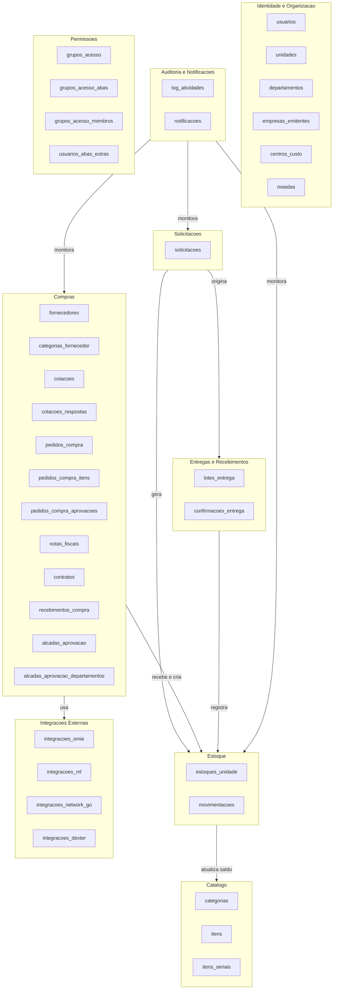

### Visão narrativa dos fluxos

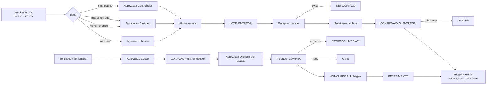

---

## 3. Resumo das tabelas (completo, ordenado por domínio)

### Identidade & Organização (6)
- `usuarios`
- `unidades`
- `departamentos`
- `empresas_emitentes` ⭐ NOVO (4 CNPJs)
- `centros_custo`
- `moedas`

### Catálogo (3)
- `categorias`
- `itens` (com `eh_movel`, `empresa_emitente_padrao_id`)
- `itens_seriais`

### Estoque (2)
- `estoques_unidade`
- `movimentacoes`

### Solicitações (1)
- `solicitacoes` (tipo: `material` | `furniture_to_unit` | `furniture_removal` | `loan`)

### Entregas (2)
- `lotes_entrega`
- `confirmacoes_entrega`

### Compras (12)
- `fornecedores`
- `categorias_fornecedor`
- `solicitacoes_compra` (extensão de `solicitacoes` com tipo `purchase`? OU tabela própria — decisão pendente)
- `cotacoes`
- `cotacoes_respostas` (resposta de cada fornecedor)
- `pedidos_compra`
- `pedidos_compra_itens`
- `pedidos_compra_aprovacoes`
- `notas_fiscais`
- `contratos`
- `recebimentos_compra`
- `alcadas_aprovacao`
- `alcadas_aprovacao_departamentos`

### Integrações Externas (4)
- `integracoes_omie`
- `integracoes_ml`
- `integracoes_network_go`
- `integracoes_dexter`

### Auditoria & Notificações (2)
- `log_atividades`
- `notificacoes`

### Permissões (4)
- `grupos_acesso`
- `grupos_acesso_abas`
- `grupos_acesso_membros`
- `usuarios_abas_extras`

**TOTAL ESTIMADO: ~36 tabelas** (pode reduzir após decisões pendentes — algumas tabelas de compras podem ser unificadas).

---

## 4. Decisões consolidadas

| # | Decisão | Origem | Status |
|---|---|---|---|
| D1 | Tabelas e colunas em pt-br snake_case sem acento | Refatoração combinada | ✅ Confirmado |
| D2 | Valores de enum (`tipo`, `status`, `acao`) em inglês | Refatoração combinada | ✅ Confirmado |
| D3 | Empréstimo embutido em `movimentacoes` (sem tabela própria) | Refatoração combinada | ✅ Confirmado |
| D4 | Schema do zero — apagar tudo e recriar | Refatoração combinada | ✅ Confirmado |
| D5 | Catálogo único com `eh_movel` (substitui produtos × móveis separados) | Já existia parcialmente | ✅ Confirmado |
| D6 | Solicitações unificadas em uma tabela com `tipo` | Refatoração combinada | ✅ Confirmado |
| D7 | `log_atividades` genérica para timeline de qualquer entidade | Refatoração combinada | ✅ Confirmado |
| D8 | Pré-pedido eliminado — só existe cotação (com 1 ou N fornecedores) | Reunião | ✅ Confirmado |
| D9 | 2 camadas de aprovação em compras: gestor (sem valor) → diretoria por alçada | Reunião | ✅ Confirmado |
| D10 | Recepção apenas recebe; CL/Assistente confere | Reunião | ✅ Confirmado |
| D11 | Lote de entrega vincula múltiplas solicitações (qualquer tipo) | Schema novo | ✅ Confirmado |
| D12 | 4 CNPJs (empresas_emitentes) com regra de roteamento por categoria | Reunião | ✅ Confirmado |
| D13 | 1 pedido pode ter N notas fiscais; 1 cotação pode agregar N solicitações | Reunião | ✅ Confirmado |
| D14 | Hierarquia: Contrato → Pedidos → Notas Fiscais; trigger debita saldo | Reunião | ✅ Confirmado |
| D15 | Local de entrega presente em cotação E pedido (default: estoque central) | Reunião | ✅ Confirmado |
| D16 | Sincronização Omie via job diário + botão manual (admin/gestor) | Reunião | ✅ Confirmado |

---

## 5. Pendências e decisões técnicas

### 5.1 Decisões técnicas adotadas (precisam confirmação do PO)

| # | Decisão | Justificativa |
|---|---|---|
| DT1 (era P1) | **`solicitacoes` core e `solicitacoes_compra` separadas** | Compras tem 15+ campos próprios (CNPJ, contrato, fornecedor sugerido, justificativa de compra, anexo de orçamento). Forçar tudo numa só vira tabela wide com NULL em massa. |
| DT2 (era P3) | **Tabela `lotes_entrega_itens` normalizada** (não array) | Permite FK, índice próprio, queries SQL nativas (JOIN), e migração futura sem quebrar dados. Array PG perde tudo isso. |
| DT3 (era P4) | **Empréstimo passa por `solicitacoes` com `tipo='loan'`** | Foi definido que controlador aprova empréstimos. Sem etapa de solicitação prévia, não há onde fazer aprovação. A movimentação `loan_out` só é criada após status `approved`. |
| DT4 (era P7) | **`cotacoes_respostas` em tabela separada** | Cada fornecedor responde com vários campos próprios + anexos. JSONB enterraria dados consultáveis. |
| DT5 (era P9) | **CNPJ padrão por categoria via tabela `itens`** (coluna `empresa_emitente_padrao_id`) | Já temos categoria + item; basta uma coluna. Tabela auxiliar seria over-engineering. |
| DT6 (era P12) | **NF de devolução: campo `tipo` em `notas_fiscais`** (`'entrada' \| 'devolucao' \| 'servico'`) | Estrutura de dados é a mesma; só muda a semântica. Tabela própria seria duplicação. |

### 5.2 Pendências ainda em aberto (não bloqueantes)

| # | Pendência | Onde aparece | Recomendação atual |
|---|---|---|---|
| P2 | `itens_seriais` é criada no esquema inicial ou só quando aparecer demanda? | Catálogo | Criar agora — custa pouco e evita migração futura |
| P5 | `notificacoes` permanece tabela própria ou vira filtro sobre `log_atividades`? | Auditoria | Manter separada — `notificacoes` tem `lido_em` e índice próprio para "não-lidas" |
| P6 | Manter perfil `executor` ou absorver em `controller`? | Identidade | Absorver — é redundante com `controller` |
| P8 | "Compra via caixinha" (cartão Suhaila) entra no sistema? | Compras | **Pendente decisão de gestão** — não é técnica |
| P10 | Cancelamento de pedido pós-envio ao fornecedor | Compras | Status `cancelled` + log; sem tabela nova |
| P11 | Aprovação fora do horário comercial / delegação por SLA | Compras | V2 — complexo demais para MVP |

---

## 7. Domínio: Identidade & Organização

### 7.1 `usuarios`
Tabela mestra de pessoas que usam o sistema. Vinculada ao Supabase Auth via `auth_usuario_id`.

```sql
CREATE TABLE usuarios (
  id                          uuid PRIMARY KEY DEFAULT gen_random_uuid(),
  auth_usuario_id             uuid UNIQUE,                       -- FK para auth.users (Supabase)
  nome                        text NOT NULL,
  email                       text NOT NULL UNIQUE,
  perfil                      text NOT NULL,                     -- enum em inglês: ver CHECK
  cargo                       text,
  unidade_primaria_id         uuid REFERENCES unidades(id),
  unidades_adicionais_ids     uuid[] DEFAULT '{}',               -- multi-unidade (ex: CL de 3 prédios)
  departamento_id             uuid REFERENCES departamentos(id),
  tipo_almoxarifado           text,                              -- 'storage' | 'delivery' (apenas perfil=warehouse)
  tipo_admin                  text,                              -- 'units' | 'warehouse' (apenas perfil=admin)
  codigo_diario               text,                              -- 6 dígitos para QR de entrega
  codigo_diario_gerado_em     timestamptz,
  exige_troca_senha           boolean DEFAULT false,
  ativo                       boolean DEFAULT true,
  criado_em                   timestamptz DEFAULT now(),
  atualizado_em               timestamptz DEFAULT now(),

  CONSTRAINT chk_usuarios_perfil CHECK (perfil IN (
    'developer', 'admin', 'controller', 'warehouse', 'driver',
    'designer', 'requester', 'buyer', 'financial', 'purchases_admin'
  )),
  CONSTRAINT chk_usuarios_warehouse_type CHECK (
    tipo_almoxarifado IS NULL OR tipo_almoxarifado IN ('storage', 'delivery')
  ),
  CONSTRAINT chk_usuarios_admin_type CHECK (
    tipo_admin IS NULL OR tipo_admin IN ('units', 'warehouse')
  )
);

CREATE INDEX idx_usuarios_perfil ON usuarios(perfil) WHERE ativo = true;
CREATE INDEX idx_usuarios_unidade_primaria ON usuarios(unidade_primaria_id);
CREATE INDEX idx_usuarios_departamento ON usuarios(departamento_id);
```

**Decisões importantes:**
- `executor` foi **removido** do enum de perfis (decisão DT-implícita: absorver em `controller`)
- `unidades_adicionais_ids` continua como `uuid[]` — caso de uso muito simples (ler tudo de uma vez), não justifica tabela normalizada
- `codigo_diario` continua aqui mesmo com `log_atividades` — é estado vivo, não histórico

---

### 7.2 `unidades`
Prédios/escritórios da Gowork.

```sql
CREATE TABLE unidades (
  id                  uuid PRIMARY KEY DEFAULT gen_random_uuid(),
  nome                text NOT NULL,
  endereco            text,
  tipo                text,                                    -- 'office' | 'warehouse' | 'coworking'
  andares             jsonb DEFAULT '[]'::jsonb,               -- ["Térreo", "1º andar", "Mezanino"]
  status              text NOT NULL DEFAULT 'active',          -- 'active' | 'inactive'
  empresa_emitente_padrao_id  uuid REFERENCES empresas_emitentes(id),  -- CNPJ default p/ pedidos desta unidade
  criado_em           timestamptz DEFAULT now(),
  atualizado_em       timestamptz DEFAULT now(),

  CONSTRAINT chk_unidades_status CHECK (status IN ('active', 'inactive'))
);

CREATE INDEX idx_unidades_status ON unidades(status);
```

**Notas:**
- `andares` JSONB: campo simples de texto livre, lido inteiro pela UI. Não há queries sobre andar específico que justifiquem tabela própria
- `empresa_emitente_padrao_id`: cada unidade tem um CNPJ-padrão (ex: 302 e 475 podem ter Goevo Offices, mas alguma unidade específica pode ter Co-Services)

---

### 7.3 `departamentos`
Setores/áreas funcionais (Obras, Arquitetura, Facilities, TI, etc.).

```sql
CREATE TABLE departamentos (
  id                          uuid PRIMARY KEY DEFAULT gen_random_uuid(),
  nome                        text NOT NULL,
  descricao                   text,
  responsavel_usuario_id      uuid REFERENCES usuarios(id),    -- gestor do depto
  ativo                       boolean DEFAULT true,
  criado_em                   timestamptz DEFAULT now(),
  atualizado_em               timestamptz DEFAULT now()
);

CREATE INDEX idx_departamentos_ativo ON departamentos(ativo);
```

**Notas:**
- `responsavel_usuario_id` é o gestor do depto. Usado em alçadas de aprovação técnica de compras.
- Estrutura plana (sem hierarquia). Se precisar sub-departamentos no futuro, adicionar `departamento_pai_id`.

---

### 7.4 `empresas_emitentes` ⭐ NOVA
Os **4 CNPJs** da Gowork. Modelagem nova específica para o módulo de compras (citado na reunião).

```sql
CREATE TABLE empresas_emitentes (
  id                  uuid PRIMARY KEY DEFAULT gen_random_uuid(),
  razao_social        text NOT NULL,
  nome_fantasia       text,
  cnpj                text NOT NULL UNIQUE,                    -- 14 dígitos sem máscara
  inscricao_estadual  text,
  inscricao_municipal text,
  regime_tributario   text,                                    -- 'simples' | 'lucro_presumido' | 'lucro_real'
  endereco            jsonb DEFAULT '{}'::jsonb,               -- {logradouro, numero, complemento, bairro, cidade, uf, cep}
  dados_bancarios     jsonb DEFAULT '{}'::jsonb,               -- {banco, agencia, conta, pix}
  contato_email       text,
  contato_telefone    text,
  ativo               boolean DEFAULT true,
  criado_em           timestamptz DEFAULT now(),
  atualizado_em       timestamptz DEFAULT now(),

  CONSTRAINT chk_empresas_regime CHECK (
    regime_tributario IS NULL OR regime_tributario IN ('simples', 'lucro_presumido', 'lucro_real')
  ),
  CONSTRAINT chk_empresas_cnpj_formato CHECK (cnpj ~ '^[0-9]{14}$')
);

CREATE INDEX idx_empresas_emitentes_ativo ON empresas_emitentes(ativo);
CREATE UNIQUE INDEX idx_empresas_emitentes_cnpj ON empresas_emitentes(cnpj);
```

**Por que essa tabela existe:**
- Reunião deixou claro: **4 CNPJs** (`Goevo Offices`, `Co-Services`, e mais 2)
- Cada pedido de compra precisa identificar qual empresa está emitindo
- Roteamento por categoria (café/açúcar/limpeza → Co-Services; resto → Goevo Offices)
- Antes era texto livre `cnpj_solicitante` em `purchase_requests` — sai dessa pra entidade real

**Seed inicial sugerido:**
```sql
INSERT INTO empresas_emitentes (razao_social, nome_fantasia, cnpj, regime_tributario, ativo) VALUES
  ('GO WORK NEGOCIOS LTDA', 'Goevo Offices', '00000000000001', 'lucro_presumido', true),
  ('GO WORK SERVICOS LTDA', 'Co-Services',   '00000000000002', 'lucro_presumido', true),
  ('___ a definir ___',     '___ CNPJ 3 ___', '00000000000003', null, true),
  ('___ a definir ___',     '___ CNPJ 4 ___', '00000000000004', null, true);
```
> CNPJs reais e razões sociais a confirmar com Sanchez/Mike.

---

### 7.5 `centros_custo`
Centros de custo financeiros. Usados em pedidos de compra e contratos.

```sql
CREATE TABLE centros_custo (
  id          uuid PRIMARY KEY DEFAULT gen_random_uuid(),
  codigo      text NOT NULL UNIQUE,                            -- ex: 'CC-001', 'OBRAS-302'
  nome        text NOT NULL,
  descricao   text,
  empresa_emitente_id  uuid REFERENCES empresas_emitentes(id), -- centro de custo é por CNPJ
  ativo       boolean DEFAULT true,
  criado_em   timestamptz DEFAULT now()
);

CREATE INDEX idx_centros_custo_ativo ON centros_custo(ativo);
CREATE INDEX idx_centros_custo_empresa ON centros_custo(empresa_emitente_id);
```

**Nota:** centros de custo pertencem a uma empresa emitente específica — não compartilhados entre CNPJs.

---

### 7.6 `moedas`
Moedas suportadas (BRL como padrão).

```sql
CREATE TABLE moedas (
  id          uuid PRIMARY KEY DEFAULT gen_random_uuid(),
  codigo      text NOT NULL UNIQUE,                            -- 'BRL' | 'USD' | 'EUR'
  simbolo     text NOT NULL,                                   -- 'R$' | '$' | '€'
  nome        text NOT NULL,                                   -- 'Real Brasileiro' | 'Dolar' | 'Euro'
  ativo       boolean DEFAULT true,
  criado_em   timestamptz DEFAULT now()
);

INSERT INTO moedas (codigo, simbolo, nome) VALUES
  ('BRL', 'R$', 'Real Brasileiro'),
  ('USD', '$', 'Dólar Americano'),
  ('EUR', '€', 'Euro');
```

---

### 7.7 Diagrama do domínio Identidade & Organização

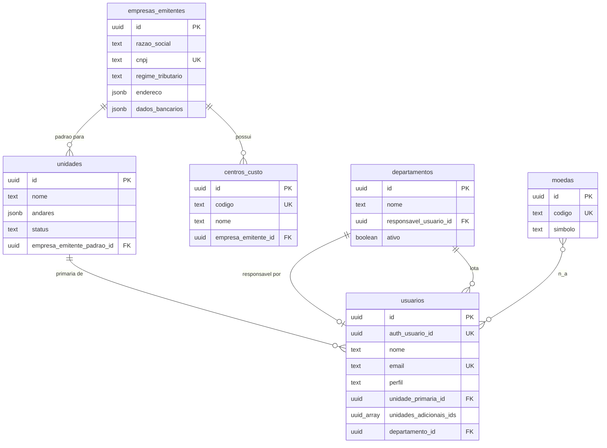

---

## 9. Domínio: Catálogo

Catálogo unificado de produtos e móveis. Decisão fundamental: **NÃO** existem tabelas separadas para "produto" e "móvel" — apenas um `itens` com flag `eh_movel`.

### 9.1 `categorias`
Agrupamento livre para o catálogo (Mobiliário, Eletrônicos, Material de Escritório, Limpeza, Café, etc.).

```sql
CREATE TABLE categorias (
  id          uuid PRIMARY KEY DEFAULT gen_random_uuid(),
  nome        text NOT NULL,
  descricao   text,
  ativo       boolean DEFAULT true,
  criado_em   timestamptz DEFAULT now()
);

CREATE INDEX idx_categorias_ativo ON categorias(ativo);
```

**Notas:**
- Estrutura plana (sem hierarquia). Se aparecer demanda de subcategoria, adicionar `categoria_pai_id`.
- Uma categoria pode conter produtos E móveis (não há restrição). É só um agrupador.

---

### 9.2 `itens` ⭐ catálogo unificado

```sql
CREATE TABLE itens (
  id                              uuid PRIMARY KEY DEFAULT gen_random_uuid(),
  produto_codigo                  int UNIQUE,                      -- código numérico legível (ex: 1, 2, 1042)
  categoria_id                    uuid REFERENCES categorias(id),
  nome                            text NOT NULL,
  descricao                       text,
  marca                           text,
  modelo                          text,
  unidade_medida                  text NOT NULL,                   -- 'un', 'kg', 'm', 'l', 'cx'
  url_imagem                      text,

  -- Tipo
  eh_movel                        boolean DEFAULT false,           -- true = móvel (passa por designer)
  eh_consumivel                   boolean DEFAULT false,           -- consumido (não retorna ao estoque)
  eh_serial_unico                 boolean DEFAULT false,           -- exige serial individual em itens_seriais

  -- Empréstimo
  permite_emprestimo              boolean DEFAULT false,
  exige_termo_responsabilidade    boolean DEFAULT false,
  dias_emprestimo_padrao          int,                             -- 7, 30, 90...

  -- Estoque
  quantidade_minima_padrao        numeric(15,3) DEFAULT 0,         -- usado em alertas de ressuprimento

  -- Compras
  empresa_emitente_padrao_id      uuid REFERENCES empresas_emitentes(id),  -- CNPJ default em pedidos
  preco_referencia                numeric(15,2),                   -- última compra ou preço médio
  fornecedor_preferencial_id      uuid REFERENCES fornecedores(id),-- sugestão automática em cotação

  ativo                           boolean DEFAULT true,
  criado_em                       timestamptz DEFAULT now(),
  atualizado_em                   timestamptz DEFAULT now(),

  CONSTRAINT chk_itens_consumivel_movel CHECK (NOT (eh_movel AND eh_consumivel))   -- móvel não é consumível
);

CREATE INDEX idx_itens_categoria ON itens(categoria_id);
CREATE INDEX idx_itens_eh_movel ON itens(eh_movel) WHERE ativo = true;
CREATE INDEX idx_itens_ativo ON itens(ativo);
CREATE INDEX idx_itens_fornecedor_pref ON itens(fornecedor_preferencial_id);
CREATE INDEX idx_itens_empresa_padrao ON itens(empresa_emitente_padrao_id);
CREATE INDEX idx_itens_nome_search ON itens USING GIN (to_tsvector('portuguese', nome || ' ' || COALESCE(descricao, '')));
```

**Decisões de design:**

| Coluna | Por quê |
|---|---|
| `produto_codigo` | Inteiro legível para humanos (ex: "Cadeado #1", "Cabo HDMI #2"). UUID é técnico, código é UX |
| `eh_movel` | Define se o item passa pelo fluxo de designer ou pelo fluxo de almox |
| `eh_consumivel` | Itens consumíveis não disparam empréstimo, só `exit` direto |
| `eh_serial_unico` | Itens que exigem rastreio individual via `itens_seriais` (notebooks, equipamentos caros) |
| `permite_emprestimo` | Algumas categorias não fazem sentido emprestar (ex: papel A4) |
| `empresa_emitente_padrao_id` | Roteamento automático para CNPJ correto na hora de comprar (resolução do P9 / DT5) |
| `fornecedor_preferencial_id` | Reunião pediu: "quando criar cotação, sugerir fornecedor que costuma vender esse produto" |
| `preco_referencia` | Útil para alerta "valor 30% acima do histórico" no aprovação |
| Índice GIN em `nome+descricao` | Busca textual rápida (PT-BR) na UI |

**CHECK importante:** `eh_movel` e `eh_consumivel` são mutuamente exclusivos.

---

### 9.3 `itens_seriais`
Instâncias com número de série rastreado individualmente (notebooks, projetores, equipamentos caros).

```sql
CREATE TABLE itens_seriais (
  id              uuid PRIMARY KEY DEFAULT gen_random_uuid(),
  item_id         uuid NOT NULL REFERENCES itens(id),
  numero_serial   text NOT NULL,
  unidade_id      uuid REFERENCES unidades(id),                  -- onde está fisicamente agora
  status          text NOT NULL DEFAULT 'available',             -- 'available' | 'in_use' | 'on_loan' | 'lost' | 'discarded' | 'maintenance'
  responsavel_atual_id  uuid REFERENCES usuarios(id),            -- quem tem em mãos (se on_loan ou in_use)
  observacoes     text,
  criado_em       timestamptz DEFAULT now(),
  atualizado_em   timestamptz DEFAULT now(),

  CONSTRAINT chk_itens_seriais_status CHECK (
    status IN ('available', 'in_use', 'on_loan', 'lost', 'discarded', 'maintenance')
  ),
  CONSTRAINT uq_itens_seriais UNIQUE (item_id, numero_serial)
);

CREATE INDEX idx_itens_seriais_item ON itens_seriais(item_id);
CREATE INDEX idx_itens_seriais_status ON itens_seriais(status);
CREATE INDEX idx_itens_seriais_unidade ON itens_seriais(unidade_id);
CREATE INDEX idx_itens_seriais_responsavel ON itens_seriais(responsavel_atual_id) WHERE status IN ('on_loan', 'in_use');
```

**Notas:**
- Só existem registros aqui para itens com `itens.eh_serial_unico = true`
- `status` reflete o estado atual; mudanças geram movimentações em `movimentacoes`
- `responsavel_atual_id` denormalizado para query rápida ("quais notebooks estão com o João?") sem precisar varrer movimentações

---

### 9.4 Diagrama do domínio Catálogo

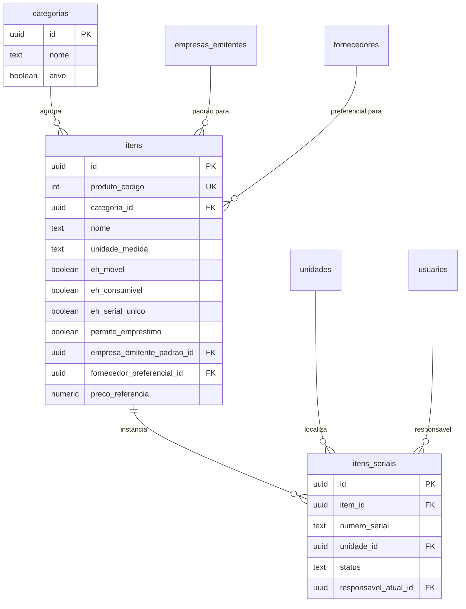

---

## 11. Domínio: Estoque & Movimentações

Núcleo operacional. **Toda alteração de saldo passa por `movimentacoes`** — manual, automática (compra recebida), transferência. Trigger mantém `estoques_unidade` consistente.

### 11.1 `estoques_unidade`
Saldo de cada item em cada unidade.

```sql
CREATE TABLE estoques_unidade (
  id                  uuid PRIMARY KEY DEFAULT gen_random_uuid(),
  item_id             uuid NOT NULL REFERENCES itens(id),
  unidade_id          uuid NOT NULL REFERENCES unidades(id),
  quantidade          numeric(15,3) NOT NULL DEFAULT 0,
  quantidade_minima   numeric(15,3) NOT NULL DEFAULT 0,        -- alerta de ressuprimento
  localizacao         text,                                    -- 'Prateleira A1', 'Almox 2', 'Sala 305'
  criado_em           timestamptz DEFAULT now(),
  atualizado_em       timestamptz DEFAULT now(),

  CONSTRAINT uq_estoques_unidade UNIQUE (item_id, unidade_id),
  CONSTRAINT chk_estoques_qtd_nao_negativa CHECK (quantidade >= 0)
);

CREATE INDEX idx_estoques_unidade ON estoques_unidade(unidade_id);
CREATE INDEX idx_estoques_item ON estoques_unidade(item_id);
CREATE INDEX idx_estoques_abaixo_minimo ON estoques_unidade(item_id, unidade_id) WHERE quantidade < quantidade_minima;
```

**Decisões:**
- `quantidade` e `quantidade_minima` em `numeric(15,3)` para suportar fracionários (kg, m, litros)
- `CHECK (quantidade >= 0)` garante que nunca há saldo negativo (movimentação de saída deve falhar se não há saldo)
- Índice parcial `idx_estoques_abaixo_minimo` é o mais usado: lista itens em alerta de ressuprimento

---

### 11.2 `movimentacoes` ⭐ tabela única para TUDO

```sql
CREATE TABLE movimentacoes (
  id                              uuid PRIMARY KEY DEFAULT gen_random_uuid(),
  tipo                            text NOT NULL,                 -- ver enum abaixo
  item_id                         uuid NOT NULL REFERENCES itens(id),
  quantidade                      numeric(15,3) NOT NULL,        -- pode ser negativa em adjustment
  usuario_id                      uuid NOT NULL REFERENCES usuarios(id),  -- quem executou no sistema

  -- Localização (semântica varia por tipo)
  unidade_id                      uuid REFERENCES unidades(id),  -- entrada/saída simples: unidade afetada
  unidade_origem_id               uuid REFERENCES unidades(id),  -- transferência: origem
  unidade_destino_id              uuid REFERENCES unidades(id),  -- transferência: destino

  -- Empréstimo (preenchido quando tipo='loan_out' ou 'loan_return')
  tomador_usuario_id              uuid REFERENCES usuarios(id),
  emprestimo_devolucao_prevista   timestamptz,
  movimentacao_origem_id          uuid REFERENCES movimentacoes(id),  -- loan_return aponta para o loan_out

  -- Vínculos com outros domínios
  solicitacao_id                  uuid REFERENCES solicitacoes(id),    -- se veio de uma solicitação
  lote_entrega_id                 uuid REFERENCES lotes_entrega(id),   -- se foi entregue em lote
  serial_id                       uuid REFERENCES itens_seriais(id),   -- se for serial único
  pedido_compra_id                uuid REFERENCES pedidos_compra(id),  -- se foi recebimento de compra
  nota_fiscal_id                  uuid REFERENCES notas_fiscais(id),   -- se foi recebimento com NF

  -- Metadados
  observacoes                     text,
  ordem_servico                   text,                          -- OS de execução (ex: equipe técnica)
  motivo_descarte                 text,                          -- justificativa (tipo='disposal')
  metadados                       jsonb DEFAULT '{}'::jsonb,     -- campos raros/futuros

  criado_em                       timestamptz NOT NULL DEFAULT now(),

  CONSTRAINT chk_movimentacoes_tipo CHECK (tipo IN (
    'entry', 'exit', 'transfer', 'loan_out', 'loan_return', 'disposal', 'adjustment'
  )),
  CONSTRAINT chk_movimentacoes_transfer CHECK (
    tipo <> 'transfer' OR (unidade_origem_id IS NOT NULL AND unidade_destino_id IS NOT NULL)
  ),
  CONSTRAINT chk_movimentacoes_loan_out CHECK (
    tipo <> 'loan_out' OR (tomador_usuario_id IS NOT NULL AND emprestimo_devolucao_prevista IS NOT NULL)
  ),
  CONSTRAINT chk_movimentacoes_loan_return CHECK (
    tipo <> 'loan_return' OR movimentacao_origem_id IS NOT NULL
  ),
  CONSTRAINT chk_movimentacoes_quantidade CHECK (
    -- adjustment pode ser negativo; resto deve ser positivo
    (tipo = 'adjustment') OR (quantidade > 0)
  )
);

CREATE INDEX idx_mov_tipo ON movimentacoes(tipo, criado_em DESC);
CREATE INDEX idx_mov_item ON movimentacoes(item_id, criado_em DESC);
CREATE INDEX idx_mov_unidade ON movimentacoes(unidade_id, criado_em DESC);
CREATE INDEX idx_mov_unidade_origem ON movimentacoes(unidade_origem_id) WHERE tipo = 'transfer';
CREATE INDEX idx_mov_unidade_destino ON movimentacoes(unidade_destino_id) WHERE tipo = 'transfer';
CREATE INDEX idx_mov_tomador ON movimentacoes(tomador_usuario_id) WHERE tipo = 'loan_out';
CREATE INDEX idx_mov_origem ON movimentacoes(movimentacao_origem_id) WHERE tipo = 'loan_return';
CREATE INDEX idx_mov_solicitacao ON movimentacoes(solicitacao_id);
CREATE INDEX idx_mov_pedido_compra ON movimentacoes(pedido_compra_id);
CREATE INDEX idx_mov_serial ON movimentacoes(serial_id) WHERE serial_id IS NOT NULL;
CREATE INDEX idx_mov_emprestimo_atrasado ON movimentacoes(emprestimo_devolucao_prevista)
  WHERE tipo = 'loan_out';
```

---

### 11.3 Catálogo de tipos de movimento (semântica detalhada)

| `tipo` | Significado | Campos obrigatórios | Efeito em `estoques_unidade` |
|---|---|---|---|
| `entry` | Entrada genérica de material no estoque (manual ou via compra) | `unidade_id`, `quantidade > 0` | `quantidade += movimento.quantidade` |
| `exit` | Saída/consumo do estoque (entrega para unidade, consumo de obra) | `unidade_id`, `quantidade > 0` | `quantidade -= movimento.quantidade` |
| `transfer` | Transferência direta entre unidades (sem passar pelo almox central) | `unidade_origem_id`, `unidade_destino_id` | `origem -= qtd`; `destino += qtd` |
| `loan_out` | Item retirado por empréstimo | `unidade_id`, `tomador_usuario_id`, `emprestimo_devolucao_prevista` | `quantidade -= qtd` |
| `loan_return` | Devolução de empréstimo | `unidade_id`, `movimentacao_origem_id` | `quantidade += qtd` |
| `disposal` | Descarte (móvel inservível, item vencido) | `unidade_id`, `motivo_descarte` | `quantidade -= qtd` |
| `adjustment` | Ajuste manual de inventário (positivo ou negativo) | `unidade_id`, `quantidade` | `quantidade += qtd` (pode ser negativo) |

**Regra crítica:** `adjustment` é o único tipo onde `quantidade` pode ser negativa. Todos os outros têm `quantidade > 0` e o sinal é determinado pelo `tipo`.

---

### 11.4 Como cada fluxo gera movimentações

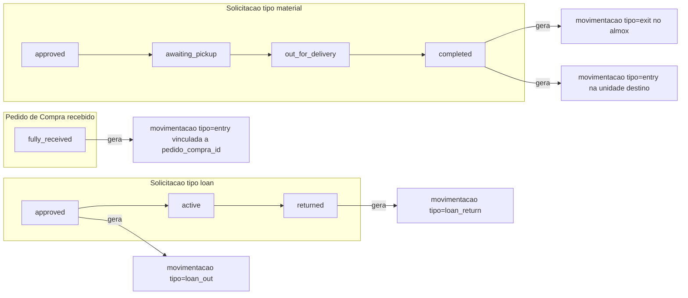

**Decisões importantes:**
- Pedido tipo `material` que vai do almox para outra unidade gera **2 movimentações** (`exit` no almox + `entry` na unidade) **OU** uma única `transfer`. Decisão técnica: usar `transfer` quando ambas as pontas são unidades Gowork; usar `exit + entry` quando há entrada de fornecedor envolvida.
- `loan_return` SEMPRE aponta para o `loan_out` original via `movimentacao_origem_id`. Isso permite as views `emprestimos_ativos` e `emprestimos_atrasados`.
- `adjustment` deve ter justificativa em `observacoes` (não há CHECK constraint; é convenção da UI).

---

### 11.5 Diagrama do domínio Estoque

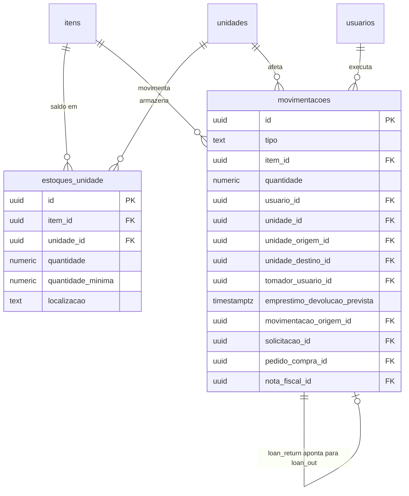

---

## 13. Domínio: Solicitações (operacionais)

Tabela única que cobre **4 tipos** de pedido interno:
- `material` — solicitante pede material do almox para sua unidade
- `furniture_to_unit` — controlador pede móvel para sua unidade (passa por designer)
- `furniture_removal` — solicita retirada de móvel da unidade (designer decide armazenar/descartar)
- `loan` — solicita empréstimo de item (precisa aprovação do controlador)

**Importante:** **NÃO inclui solicitações de compra** (DT1). Compras é tabela separada (`solicitacoes_compra` na Seção 15).

### 13.1 `solicitacoes`

```sql
CREATE TABLE solicitacoes (
  id                          uuid PRIMARY KEY DEFAULT gen_random_uuid(),
  numero                      text UNIQUE,                       -- número legível (gerado por trigger): SOL-2026-00001
  tipo                        text NOT NULL,
  status                      text NOT NULL,

  -- O que e quanto
  item_id                     uuid NOT NULL REFERENCES itens(id),
  quantidade                  numeric(15,3) NOT NULL,

  -- Quem solicita
  unidade_solicitante_id      uuid NOT NULL REFERENCES unidades(id),
  solicitado_por_usuario_id   uuid NOT NULL REFERENCES usuarios(id),

  -- Detalhes específicos por tipo (NULL quando não aplicável)
  andar_destino               text,                              -- furniture_to_unit
  localizacao_detalhe         text,                              -- furniture_to_unit (onde ficará)
  justificativa               text,                              -- furniture_to_unit, loan
  urgencia                    text NOT NULL DEFAULT 'medium',    -- 'low' | 'medium' | 'high'

  -- Aprovações (genéricas)
  aprovado_por_usuario_id     uuid REFERENCES usuarios(id),
  aprovado_em                 timestamptz,

  -- Específico de furniture_to_unit / furniture_removal
  designer_usuario_id         uuid REFERENCES usuarios(id),
  designer_decidido_em        timestamptz,
  decisao_descarte            text,                              -- furniture_removal: 'storage' | 'disposal'
  justificativa_descarte      text,

  -- Específico de loan
  emprestimo_devolucao_prevista  timestamptz,
  tomador_usuario_id          uuid REFERENCES usuarios(id),      -- pode ser != solicitado_por (pediu para outra pessoa)
  controlador_aprovador_id    uuid REFERENCES usuarios(id),      -- controlador que aprovou (DT3)

  -- Rejeição
  motivo_rejeicao             text,
  rejeitado_por_usuario_id    uuid REFERENCES usuarios(id),
  rejeitado_em                timestamptz,

  -- Execução / Entrega
  codigo_qr                   text,                              -- código de confirmação
  separado_por_usuario_id     uuid REFERENCES usuarios(id),      -- almox que separou
  separado_em                 timestamptz,
  pronto_retirada_em          timestamptz,
  retirado_por_usuario_id     uuid REFERENCES usuarios(id),
  retirado_em                 timestamptz,
  entregue_em                 timestamptz,
  concluido_em                timestamptz,
  cancelado_em                timestamptz,

  observacoes                 text,
  criado_em                   timestamptz NOT NULL DEFAULT now(),
  atualizado_em               timestamptz NOT NULL DEFAULT now(),

  CONSTRAINT chk_solicitacoes_tipo CHECK (tipo IN (
    'material', 'furniture_to_unit', 'furniture_removal', 'loan'
  )),
  CONSTRAINT chk_solicitacoes_urgencia CHECK (urgencia IN ('low', 'medium', 'high')),
  CONSTRAINT chk_solicitacoes_decisao_descarte CHECK (
    decisao_descarte IS NULL OR decisao_descarte IN ('storage', 'disposal')
  ),
  CONSTRAINT chk_solicitacoes_status CHECK (
    (tipo = 'material' AND status IN (
      'pending', 'approved', 'awaiting_pickup', 'out_for_delivery',
      'delivery_confirmed', 'received_confirmed', 'completed', 'rejected', 'cancelled'
    )) OR
    (tipo = 'furniture_to_unit' AND status IN (
      'pending_designer', 'approved_designer', 'approved_storage', 'separated',
      'awaiting_delivery', 'in_transit', 'pending_confirmation', 'completed', 'rejected', 'cancelled'
    )) OR
    (tipo = 'furniture_removal' AND status IN (
      'pending_designer', 'approved_storage', 'approved_disposal',
      'awaiting_pickup', 'in_transit', 'completed', 'rejected', 'cancelled'
    )) OR
    (tipo = 'loan' AND status IN (
      'pending_approval', 'approved', 'awaiting_pickup', 'active',
      'returned', 'overdue', 'rejected', 'cancelled'
    ))
  )
);

CREATE INDEX idx_solicitacoes_tipo_status ON solicitacoes(tipo, status);
CREATE INDEX idx_solicitacoes_solicitante ON solicitacoes(solicitado_por_usuario_id, criado_em DESC);
CREATE INDEX idx_solicitacoes_unidade ON solicitacoes(unidade_solicitante_id, criado_em DESC);
CREATE INDEX idx_solicitacoes_item ON solicitacoes(item_id);
CREATE INDEX idx_solicitacoes_designer ON solicitacoes(designer_usuario_id) WHERE designer_usuario_id IS NOT NULL;
CREATE INDEX idx_solicitacoes_emprestimo_atrasado ON solicitacoes(emprestimo_devolucao_prevista)
  WHERE tipo = 'loan' AND status = 'active';
CREATE INDEX idx_solicitacoes_pendentes ON solicitacoes(tipo, criado_em)
  WHERE status IN ('pending', 'pending_designer', 'pending_approval');
```

---

### 13.2 Matriz de status por tipo

#### Tipo `material` (pedido de almox para unidade)
```
pending
  ├── approved → awaiting_pickup → out_for_delivery → delivery_confirmed → received_confirmed → completed
  ├── rejected
  └── cancelled
```

#### Tipo `furniture_to_unit` (mover móvel para uma unidade)
```
pending_designer
  ├── approved_designer → approved_storage → separated → awaiting_delivery → in_transit → pending_confirmation → completed
  ├── rejected
  └── cancelled
```

#### Tipo `furniture_removal` (retirada de móvel)
```
pending_designer
  ├── approved_storage   → awaiting_pickup → in_transit → completed   (vai p/ almox)
  ├── approved_disposal  → awaiting_pickup → in_transit → completed   (vai p/ descarte)
  ├── rejected
  └── cancelled
```

#### Tipo `loan` (empréstimo, aprovado pelo controlador — DT3)
```
pending_approval
  ├── approved → awaiting_pickup → active
  │                                  ├── returned   (devolvido no prazo)
  │                                  └── overdue    (passou da data prevista; depois pode virar returned)
  ├── rejected
  └── cancelled
```

---

### 13.3 Como gerar movimentações automaticamente

Quando uma solicitação chega em determinado status, dispara uma `movimentacao` correspondente:

| `tipo` da solicitação | Status que dispara | `tipo` da movimentação gerada |
|---|---|---|
| `material` | `received_confirmed` | `exit` no almox + `entry` na unidade destino (ou `transfer`) |
| `furniture_to_unit` | `completed` | `transfer` (de origem do móvel para unidade destino) |
| `furniture_removal` (`approved_storage`) | `completed` | `transfer` (de unidade origem para almox) |
| `furniture_removal` (`approved_disposal`) | `completed` | `disposal` (com `motivo_descarte` = `justificativa_descarte`) |
| `loan` | `active` (entregue ao tomador) | `loan_out` (com `tomador_usuario_id`, `emprestimo_devolucao_prevista`) |
| `loan` | `returned` | `loan_return` (com `movimentacao_origem_id` apontando para o `loan_out`) |

> A criação da movimentação é responsabilidade da Edge Function (não trigger de banco), porque envolve regras complexas de quem é o `usuario_id` que está executando.

---

### 13.4 Geração de número legível (`numero`)
Trigger que gera `SOL-{ano}-{seq}` na inserção:

```sql
CREATE SEQUENCE IF NOT EXISTS seq_solicitacoes_numero;

CREATE OR REPLACE FUNCTION fn_gerar_numero_solicitacao() RETURNS trigger AS $$
BEGIN
  IF NEW.numero IS NULL THEN
    NEW.numero := 'SOL-' || EXTRACT(YEAR FROM NEW.criado_em) || '-' ||
                  LPAD(NEXTVAL('seq_solicitacoes_numero')::text, 5, '0');
  END IF;
  RETURN NEW;
END $$ LANGUAGE plpgsql;

CREATE TRIGGER trg_gerar_numero_solicitacao
  BEFORE INSERT ON solicitacoes
  FOR EACH ROW EXECUTE FUNCTION fn_gerar_numero_solicitacao();
```

> Detalhes do trigger virão na Seção 19 (Triggers consolidados).

---

### 13.5 Diagrama do domínio Solicitações

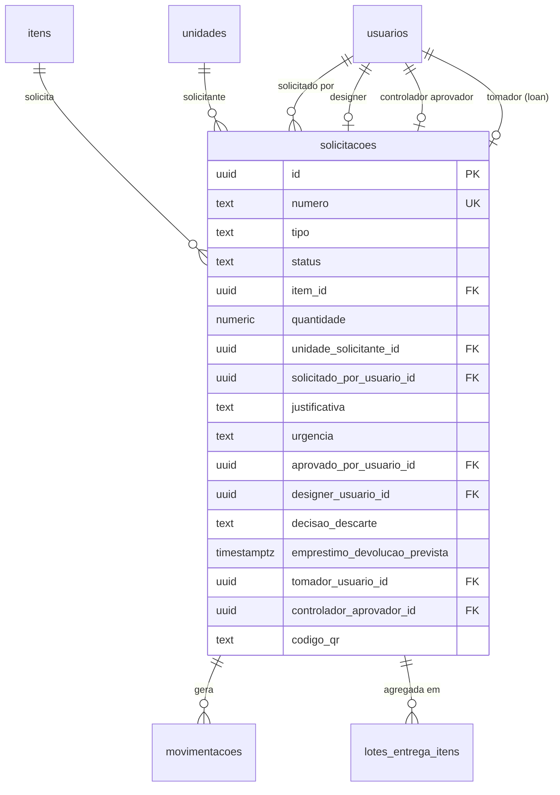

---

## 15. Domínio: Entregas & Recebimentos

Cobre dois cenários:
1. **Entregas internas** — almox/motorista leva itens (de qualquer tipo de solicitação) para uma unidade
2. **Recebimento da recepção** — recepção (Network Go) recebe pacote de fornecedor externo e notifica solicitante

Decisão DT2: `lotes_entrega_itens` é **tabela normalizada** (não array em `lotes_entrega.solicitacao_ids`).

### 15.1 `lotes_entrega`
Agrupamento de solicitações que serão entregues juntas (mesmo motorista, mesma unidade destino, mesmo dia).

```sql
CREATE TABLE lotes_entrega (
  id                          uuid PRIMARY KEY DEFAULT gen_random_uuid(),
  numero                      text UNIQUE,                       -- LOTE-2026-00001 (gerado por trigger)
  unidade_destino_id          uuid NOT NULL REFERENCES unidades(id),
  motorista_usuario_id        uuid NOT NULL REFERENCES usuarios(id),
  codigo_qr                   text NOT NULL UNIQUE,              -- escaneado pelo recebedor
  status                      text NOT NULL DEFAULT 'pending',
  despachado_em               timestamptz,
  entregue_em                 timestamptz,                       -- quando motorista marcou como entregue
  recebido_em                 timestamptz,                       -- quando recepção/CL confirmou recebimento
  concluido_em                timestamptz,                       -- ciclo fechado (pode ser igual a recebido_em)
  observacoes                 text,
  criado_em                   timestamptz NOT NULL DEFAULT now(),
  atualizado_em               timestamptz NOT NULL DEFAULT now(),

  CONSTRAINT chk_lotes_status CHECK (status IN (
    'pending', 'in_transit', 'delivered', 'received_confirmed', 'completed', 'cancelled'
  ))
);

CREATE INDEX idx_lotes_unidade_destino ON lotes_entrega(unidade_destino_id, status);
CREATE INDEX idx_lotes_motorista ON lotes_entrega(motorista_usuario_id, status);
CREATE INDEX idx_lotes_status ON lotes_entrega(status);
CREATE UNIQUE INDEX idx_lotes_codigo_qr ON lotes_entrega(codigo_qr);
```

**Status do lote:**
```
pending → in_transit → delivered → received_confirmed → completed
                                                          ↓
                                                      cancelled (em qualquer ponto)
```

---

### 15.2 `lotes_entrega_itens` (tabela normalizada — DT2)
N solicitações por lote.

```sql
CREATE TABLE lotes_entrega_itens (
  id                  uuid PRIMARY KEY DEFAULT gen_random_uuid(),
  lote_id             uuid NOT NULL REFERENCES lotes_entrega(id) ON DELETE CASCADE,
  solicitacao_id      uuid NOT NULL REFERENCES solicitacoes(id),
  ordem               int DEFAULT 0,                             -- ordem visual na listagem do motorista
  criado_em           timestamptz NOT NULL DEFAULT now(),

  CONSTRAINT uq_lotes_entrega_itens UNIQUE (lote_id, solicitacao_id)
);

CREATE INDEX idx_lotes_itens_lote ON lotes_entrega_itens(lote_id, ordem);
CREATE INDEX idx_lotes_itens_solicitacao ON lotes_entrega_itens(solicitacao_id);
```

**Por que normalizada (em vez de array):**
- Permite `JOIN` direto entre lotes e solicitações
- Permite query "todas as solicitações que ainda não foram entregues" sem desempacotar arrays
- Permite ordenar visualmente (`ordem`)
- Permite remover/adicionar item ao lote sem reescrever a linha inteira

---

### 15.3 `confirmacoes_entrega`
Cada confirmação de entrega/recebimento gera uma linha aqui. Pode haver múltiplas por lote (motorista entregou + recepção recebeu + solicitante conferiu).

```sql
CREATE TABLE confirmacoes_entrega (
  id                          uuid PRIMARY KEY DEFAULT gen_random_uuid(),
  lote_id                     uuid REFERENCES lotes_entrega(id),
  solicitacao_id              uuid REFERENCES solicitacoes(id),  -- confirmação individual (sem lote)
  tipo                        text NOT NULL,                     -- ver enum
  confirmado_por_usuario_id   uuid NOT NULL REFERENCES usuarios(id),  -- quem clicou no botão
  recebido_por_usuario_id     uuid REFERENCES usuarios(id),      -- quem efetivamente recebeu (validado por daily_code)
  url_foto                    text,                              -- foto anexada (Supabase Storage)
  url_assinatura              text,                              -- assinatura digital base64 ou storage
  localizacao                 jsonb,                             -- {latitude, longitude}
  codigo_diario               text,                              -- daily_code usado na validação
  observacoes                 text,
  criado_em                   timestamptz NOT NULL DEFAULT now(),

  CONSTRAINT chk_confirmacoes_tipo CHECK (tipo IN (
    'driver_delivery',        -- motorista entregou
    'reception_receipt',      -- recepção recebeu pacote (Network Go)
    'requester_confirm'       -- solicitante conferiu conteúdo
  )),
  CONSTRAINT chk_confirmacoes_vinculo CHECK (
    lote_id IS NOT NULL OR solicitacao_id IS NOT NULL
  )
);

CREATE INDEX idx_confirm_lote ON confirmacoes_entrega(lote_id, criado_em);
CREATE INDEX idx_confirm_solicitacao ON confirmacoes_entrega(solicitacao_id, criado_em);
CREATE INDEX idx_confirm_tipo ON confirmacoes_entrega(tipo, criado_em DESC);
CREATE INDEX idx_confirm_recebedor ON confirmacoes_entrega(recebido_por_usuario_id);
```

**Tipos de confirmação:**

| `tipo` | Quem confirma | O que faz |
|---|---|---|
| `driver_delivery` | Motorista | Marca lote como entregue. Tira foto, escaneia QR do recebedor. |
| `reception_receipt` | Recepção (via Network Go) | Confirma recebimento do pacote. NÃO confere conteúdo. Aciona notificação ao solicitante. |
| `requester_confirm` | CL/Assistente solicitante | Confere quantidade/qualidade. Fecha o ciclo. |

**Modelagem reflete a discussão da reunião:**
- Recepção tem responsabilidade limitada (`reception_receipt`)
- CL/Assistente tem responsabilidade real (`requester_confirm`)
- Cada uma é uma linha auditável separada

---

### 15.4 Diagrama do domínio Entregas

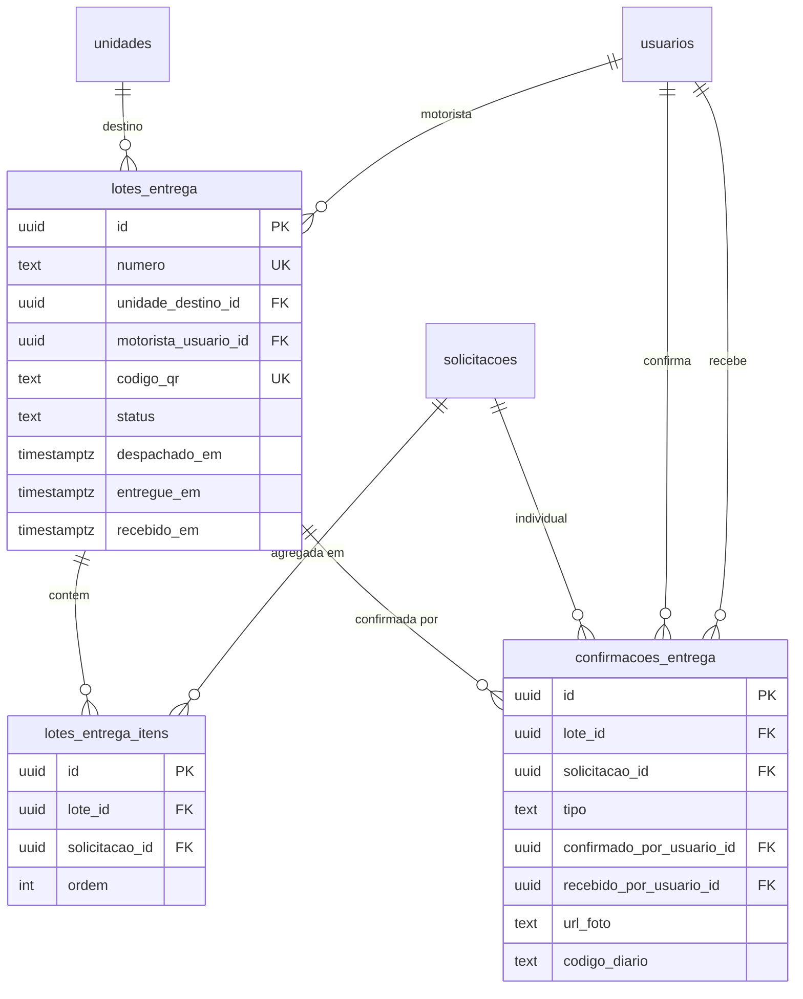

---

## 17. Domínio: Compras — Parte 1 (Cadastros, Solicitações, Cotações, Pedidos)

Pipeline completo conforme reunião:
```
Solicitação Compra → Aprovação Gestor → Cotação (1+ fornecedores) → Aprovação Diretoria (alçada) → Pedido → ...
```

### 17.1 `categorias_fornecedor`
Tipos de fornecedor (Móveis, Elétrica, Hidráulica, Mercado Livre, Café, Limpeza...).

```sql
CREATE TABLE categorias_fornecedor (
  id          uuid PRIMARY KEY DEFAULT gen_random_uuid(),
  nome        text NOT NULL UNIQUE,
  descricao   text,
  ativo       boolean DEFAULT true,
  criado_em   timestamptz DEFAULT now()
);
```

---

### 17.2 `fornecedores`

```sql
CREATE TABLE fornecedores (
  id                          uuid PRIMARY KEY DEFAULT gen_random_uuid(),
  razao_social                text NOT NULL,
  nome_fantasia               text,
  cnpj                        text UNIQUE,                      -- pode ser NULL para PF
  cpf                         text UNIQUE,                      -- caso autônomo
  inscricao_estadual          text,
  categoria_id                uuid REFERENCES categorias_fornecedor(id),

  -- Contato
  contato_nome                text,
  contato_email               text,
  contato_telefone            text,
  contato_whatsapp            text,

  -- Endereço
  endereco                    jsonb DEFAULT '{}'::jsonb,        -- {logradouro, numero, ..., uf, cep}

  -- Dados bancários
  dados_bancarios             jsonb DEFAULT '{}'::jsonb,        -- {banco, agencia, conta, pix, tipo_chave_pix}

  -- Integrações
  codigo_omie                 text,                             -- ID do fornecedor no Omie
  codigo_mercado_livre        text,                             -- vendedor ML (se aplicável)

  -- Métricas (denormalizadas, atualizadas por trigger ou job)
  total_pedidos               int DEFAULT 0,
  valor_total_comprado        numeric(15,2) DEFAULT 0,
  ultima_compra_em            timestamptz,

  -- Avaliação
  nota_avaliacao              numeric(3,2),                     -- 0.00 a 5.00 (média de avaliações)

  status                      text NOT NULL DEFAULT 'active',   -- 'active' | 'inactive' | 'blocked'
  observacoes                 text,
  criado_em                   timestamptz NOT NULL DEFAULT now(),
  atualizado_em               timestamptz NOT NULL DEFAULT now(),

  CONSTRAINT chk_fornecedores_status CHECK (status IN ('active', 'inactive', 'blocked')),
  CONSTRAINT chk_fornecedores_documento CHECK (cnpj IS NOT NULL OR cpf IS NOT NULL),
  CONSTRAINT chk_fornecedores_cnpj_formato CHECK (cnpj IS NULL OR cnpj ~ '^[0-9]{14}$'),
  CONSTRAINT chk_fornecedores_cpf_formato CHECK (cpf IS NULL OR cpf ~ '^[0-9]{11}$')
);

CREATE INDEX idx_fornecedores_status ON fornecedores(status);
CREATE INDEX idx_fornecedores_categoria ON fornecedores(categoria_id);
CREATE INDEX idx_fornecedores_omie ON fornecedores(codigo_omie) WHERE codigo_omie IS NOT NULL;
CREATE INDEX idx_fornecedores_busca ON fornecedores USING GIN (
  to_tsvector('portuguese', razao_social || ' ' || COALESCE(nome_fantasia, ''))
);
```

**Decisões:**
- Suporta tanto PJ (`cnpj`) quanto PF/autônomo (`cpf`) — CHECK garante pelo menos um
- `codigo_omie` permite vinculação com Omie via job de sync (Seção 19 — Integrações)
- Métricas denormalizadas (`total_pedidos`, `valor_total_comprado`, `ultima_compra_em`) atualizadas por trigger ou job — evita agregação on-the-fly

---

### 17.3 `solicitacoes_compra` (DT1 — separada de `solicitacoes`)

```sql
CREATE TABLE solicitacoes_compra (
  id                          uuid PRIMARY KEY DEFAULT gen_random_uuid(),
  numero                      text UNIQUE,                       -- SC-2026-00001

  -- Quem solicita
  solicitante_id              uuid NOT NULL REFERENCES usuarios(id),
  unidade_id                  uuid REFERENCES unidades(id),
  departamento_id             uuid REFERENCES departamentos(id),
  centro_custo_id             uuid REFERENCES centros_custo(id),
  empresa_emitente_id         uuid REFERENCES empresas_emitentes(id),  -- CNPJ que vai emitir o pedido

  -- Vínculos opcionais
  contrato_id                 uuid REFERENCES contratos(id),     -- se está ligada a contrato existente
  fornecedor_sugerido_id      uuid REFERENCES fornecedores(id),  -- solicitante pode sugerir
  link_referencia             text,                              -- URL externa de referência

  -- Justificativa
  justificativa               text NOT NULL,
  urgencia                    text NOT NULL DEFAULT 'medium',    -- 'low' | 'medium' | 'high'

  -- Status
  status                      text NOT NULL DEFAULT 'pending_manager',

  -- Aprovação técnica (1ª camada — gestor da área)
  aprovador_gestor_id         uuid REFERENCES usuarios(id),      -- pré-selecionado ou definido pelo solicitante
  gestor_aprovado_em          timestamptz,
  gestor_aprovado_por_id      uuid REFERENCES usuarios(id),
  gestor_motivo_rejeicao      text,

  -- Comprador atribuído (após aprovação do gestor)
  comprador_id                uuid REFERENCES usuarios(id),
  atribuido_em                timestamptz,

  -- Anexos / orçamentos do solicitante (raros — quando sabe o fornecedor de cara)
  anexos                      jsonb DEFAULT '[]'::jsonb,         -- [{nome, url}]

  cancelado_em                timestamptz,
  motivo_cancelamento         text,

  criado_em                   timestamptz NOT NULL DEFAULT now(),
  atualizado_em               timestamptz NOT NULL DEFAULT now(),

  CONSTRAINT chk_sol_compra_status CHECK (status IN (
    'pending_manager',         -- aguardando aprovação técnica do gestor
    'approved_manager',        -- gestor aprovou; pode virar cotação ou pedido direto
    'rejected_manager',        -- rejeitada pelo gestor
    'in_quotation',            -- cotação aberta
    'quotation_completed',     -- cotação finalizada (fornecedor escolhido)
    'pending_director',        -- pedido criado, aguardando aprovação da diretoria
    'in_purchase',             -- pedido aprovado, em execução
    'completed',               -- ciclo finalizado
    'cancelled'
  ))
);

CREATE TABLE solicitacoes_compra_itens (
  id                          uuid PRIMARY KEY DEFAULT gen_random_uuid(),
  solicitacao_id              uuid NOT NULL REFERENCES solicitacoes_compra(id) ON DELETE CASCADE,
  item_id                     uuid REFERENCES itens(id),         -- pode ser NULL (item ad-hoc)
  descricao                   text NOT NULL,                     -- descrição livre quando item_id é NULL
  codigo                      text,                              -- código/SKU comercial
  quantidade                  numeric(15,3) NOT NULL,
  unidade_medida              text NOT NULL,
  conta_contabil              text,                              -- plano de contas X.XX.XX
  data_necessidade            date,
  prioridade                  text DEFAULT 'normal',             -- 'normal' | 'emergencial'
  observacao                  text,
  ordem                       int DEFAULT 0,

  CONSTRAINT chk_sol_compra_itens_prioridade CHECK (prioridade IN ('normal', 'emergencial'))
);

CREATE INDEX idx_sol_compra_status ON solicitacoes_compra(status);
CREATE INDEX idx_sol_compra_solicitante ON solicitacoes_compra(solicitante_id, criado_em DESC);
CREATE INDEX idx_sol_compra_comprador ON solicitacoes_compra(comprador_id) WHERE comprador_id IS NOT NULL;
CREATE INDEX idx_sol_compra_pendentes ON solicitacoes_compra(status, criado_em)
  WHERE status IN ('pending_manager', 'approved_manager', 'pending_director');
CREATE INDEX idx_sol_compra_itens_sol ON solicitacoes_compra_itens(solicitacao_id, ordem);
CREATE INDEX idx_sol_compra_itens_item ON solicitacoes_compra_itens(item_id);
```

**Por que separada de `solicitacoes` (DT1):**
- 8 campos próprios (`comprador_id`, `centro_custo_id`, `contrato_id`, `empresa_emitente_id`, `aprovador_gestor_id`, `link_referencia`, `anexos`, `prioridade`) que não fariam sentido em material/móvel
- Status flow completamente diferente (3 fases de aprovação, cotação, pedido)
- Solicitação de compra **N→1** com cotação; cotação **N→1** com pedido — relação inexistente em solicitações operacionais
- `solicitacoes_compra_itens` é tabela separada porque uma solicitação de compra costuma ter vários itens (não é 1 item como nas operacionais)

---

### 17.4 `cotacoes`
Pode agregar 1+ solicitações de compra. Pode ter 1+ fornecedores convidados.

```sql
CREATE TABLE cotacoes (
  id                          uuid PRIMARY KEY DEFAULT gen_random_uuid(),
  numero                      text UNIQUE,                       -- COT-2026-00001
  comprador_id                uuid NOT NULL REFERENCES usuarios(id),

  data_limite_resposta        timestamptz,                       -- prazo do fornecedor
  observacoes_fornecedor      text,                              -- texto que vai no email
  local_entrega_unidade_id    uuid REFERENCES unidades(id),      -- DT15: default = estoque central
  link_preenchimento          text,                              -- URL pública para fornecedores responderem
  enviar_email_fornecedor     boolean DEFAULT true,
  copiar_solicitante_email    boolean DEFAULT false,

  status                      text NOT NULL DEFAULT 'draft',
  fornecedor_vencedor_id      uuid REFERENCES fornecedores(id),  -- após escolha
  finalizada_em               timestamptz,
  finalizada_por_id           uuid REFERENCES usuarios(id),

  criado_em                   timestamptz NOT NULL DEFAULT now(),
  atualizado_em               timestamptz NOT NULL DEFAULT now(),

  CONSTRAINT chk_cotacoes_status CHECK (status IN (
    'draft',           -- montando
    'sent',            -- enviada aos fornecedores
    'partially_responded',  -- alguns responderam
    'fully_responded', -- todos responderam
    'finalized',       -- vencedor escolhido
    'cancelled'
  ))
);

-- Quais solicitações de compra estão sendo cotadas neste pedido (N:N reunião: agrupamento)
CREATE TABLE cotacoes_solicitacoes (
  cotacao_id        uuid NOT NULL REFERENCES cotacoes(id) ON DELETE CASCADE,
  solicitacao_id    uuid NOT NULL REFERENCES solicitacoes_compra(id),
  PRIMARY KEY (cotacao_id, solicitacao_id)
);

-- Fornecedores convidados para a cotação
CREATE TABLE cotacoes_fornecedores (
  id                          uuid PRIMARY KEY DEFAULT gen_random_uuid(),
  cotacao_id                  uuid NOT NULL REFERENCES cotacoes(id) ON DELETE CASCADE,
  fornecedor_id               uuid NOT NULL REFERENCES fornecedores(id),
  email_enviado_em            timestamptz,
  link_token                  text UNIQUE,                       -- token específico para este fornecedor responder
  CONSTRAINT uq_cotacoes_fornecedores UNIQUE (cotacao_id, fornecedor_id)
);

CREATE INDEX idx_cotacoes_comprador ON cotacoes(comprador_id, status);
CREATE INDEX idx_cotacoes_status ON cotacoes(status);
CREATE INDEX idx_cot_sol_cotacao ON cotacoes_solicitacoes(cotacao_id);
CREATE INDEX idx_cot_sol_solicitacao ON cotacoes_solicitacoes(solicitacao_id);
CREATE INDEX idx_cot_forn_cotacao ON cotacoes_fornecedores(cotacao_id);
```

---

### 17.5 `cotacoes_respostas` (DT4 — separada, não JSONB)
Resposta de cada fornecedor para cada item.

```sql
CREATE TABLE cotacoes_respostas (
  id                          uuid PRIMARY KEY DEFAULT gen_random_uuid(),
  cotacao_id                  uuid NOT NULL REFERENCES cotacoes(id) ON DELETE CASCADE,
  cotacao_fornecedor_id       uuid NOT NULL REFERENCES cotacoes_fornecedores(id),
  fornecedor_id               uuid NOT NULL REFERENCES fornecedores(id),

  moeda_id                    uuid REFERENCES moedas(id),
  forma_pagamento             text,                              -- 'pix' | 'cartao' | 'boleto' | 'transferencia'
  condicoes_pagamento         text,                              -- '30 dias' | '30/60/90' | 'a vista'
  prazo_entrega_dias          int,                               -- prazo em dias
  data_previsao_entrega       date,

  -- Valores
  valor_subtotal              numeric(15,2),                     -- soma dos itens
  valor_frete                 numeric(15,2) DEFAULT 0,
  valor_desconto              numeric(15,2) DEFAULT 0,
  percentual_ipi              numeric(5,2) DEFAULT 0,
  percentual_icms             numeric(5,2) DEFAULT 0,
  percentual_pis_cofins       numeric(5,2) DEFAULT 0,
  valor_total                 numeric(15,2),                     -- calculado

  -- Status
  status                      text NOT NULL DEFAULT 'pending',
  respondido_em               timestamptz,
  observacoes_fornecedor      text,
  anexos                      jsonb DEFAULT '[]'::jsonb,         -- [{nome, url}] — orçamento PDF

  criado_em                   timestamptz NOT NULL DEFAULT now(),
  atualizado_em               timestamptz NOT NULL DEFAULT now(),

  CONSTRAINT chk_cot_resp_status CHECK (status IN (
    'pending', 'responded', 'declined', 'expired'
  ))
);

-- Itens da resposta (1 linha por item da solicitação_compra dentro da cotação)
CREATE TABLE cotacoes_respostas_itens (
  id                          uuid PRIMARY KEY DEFAULT gen_random_uuid(),
  resposta_id                 uuid NOT NULL REFERENCES cotacoes_respostas(id) ON DELETE CASCADE,
  solicitacao_compra_item_id  uuid NOT NULL REFERENCES solicitacoes_compra_itens(id),
  preco_unitario              numeric(15,4),
  quantidade                  numeric(15,3),                     -- pode diferir da solicitada
  total_item                  numeric(15,2),                     -- preco_unitario * quantidade
  observacoes                 text,

  CONSTRAINT uq_cot_resp_itens UNIQUE (resposta_id, solicitacao_compra_item_id)
);

CREATE INDEX idx_cot_resp_cotacao ON cotacoes_respostas(cotacao_id);
CREATE INDEX idx_cot_resp_fornecedor ON cotacoes_respostas(fornecedor_id);
CREATE INDEX idx_cot_resp_status ON cotacoes_respostas(status);
CREATE INDEX idx_cot_resp_itens_resposta ON cotacoes_respostas_itens(resposta_id);
```

---

### 17.6 `pedidos_compra`
Após cotação fechada (ou direto, quando é fornecedor único). Vai para aprovação de alçada.

```sql
CREATE TABLE pedidos_compra (
  id                          uuid PRIMARY KEY DEFAULT gen_random_uuid(),
  numero                      text UNIQUE,                       -- PED-2026-00001
  numero_omie                 text UNIQUE,                       -- número no Omie após sync

  cotacao_id                  uuid REFERENCES cotacoes(id),      -- pode ser NULL se não houve cotação
  fornecedor_id               uuid NOT NULL REFERENCES fornecedores(id),
  empresa_emitente_id         uuid NOT NULL REFERENCES empresas_emitentes(id),  -- qual CNPJ vai emitir

  comprador_id                uuid NOT NULL REFERENCES usuarios(id),
  solicitante_principal_id    uuid REFERENCES usuarios(id),      -- quem originou (pode ser N solicitações)
  contrato_id                 uuid REFERENCES contratos(id),     -- se vinculado a contrato

  -- Local de entrega (DT15)
  local_entrega_unidade_id    uuid REFERENCES unidades(id),      -- default: estoque central
  passa_pelo_estoque          boolean NOT NULL DEFAULT true,     -- se false: vai direto p/ unidade (não dá entrada no almox)

  -- Contato no fornecedor (cabeçalho do pedido enviado)
  contato_fornecedor_nome     text,
  contato_fornecedor_email    text,

  -- Pagamento
  moeda_id                    uuid REFERENCES moedas(id),
  forma_pagamento             text,
  condicoes_pagamento         text,

  -- Valores
  valor_subtotal              numeric(15,2),
  valor_frete                 numeric(15,2) DEFAULT 0,
  valor_desconto              numeric(15,2) DEFAULT 0,
  valor_impostos              numeric(15,2) DEFAULT 0,
  valor_total                 numeric(15,2) NOT NULL,

  -- Status
  status                      text NOT NULL DEFAULT 'pending_approval',
  status_aprovacao            text DEFAULT 'pendente',           -- 'pendente' | 'aprovado' | 'reprovado' | 'em_revisao'
  versao_aprovacao            int DEFAULT 1,                     -- incrementa quando comprador faz resend após reprovação
  aprovador_alcada_id         uuid REFERENCES usuarios(id),      -- definido por alcadas_aprovacao

  -- Datas
  enviado_fornecedor_em       timestamptz,
  data_previsao_entrega       date,
  cancelado_em                timestamptz,
  motivo_cancelamento         text,

  observacoes                 text,
  anexos                      jsonb DEFAULT '[]'::jsonb,

  criado_em                   timestamptz NOT NULL DEFAULT now(),
  atualizado_em               timestamptz NOT NULL DEFAULT now(),

  CONSTRAINT chk_pedidos_status CHECK (status IN (
    'draft',                  -- rascunho
    'pending_approval',       -- aguardando alçada
    'approved',               -- aprovado, mas ainda não enviado
    'rejected',               -- reprovado
    'sent_to_supplier',       -- enviado ao fornecedor
    'awaiting_nf',            -- aguardando nota fiscal
    'nf_issued',              -- NF emitida
    'in_transit',             -- em transporte
    'partially_received',     -- recebimento parcial
    'fully_received',         -- recebimento total (gera entry no estoque)
    'completed',              -- ciclo fechado
    'cancelled'
  )),
  CONSTRAINT chk_pedidos_status_aprovacao CHECK (
    status_aprovacao IN ('pendente', 'aprovado', 'reprovado', 'em_revisao')
  )
);

-- Itens do pedido (N por pedido)
CREATE TABLE pedidos_compra_itens (
  id                          uuid PRIMARY KEY DEFAULT gen_random_uuid(),
  pedido_id                   uuid NOT NULL REFERENCES pedidos_compra(id) ON DELETE CASCADE,
  solicitacao_compra_item_id  uuid REFERENCES solicitacoes_compra_itens(id),  -- origem
  item_id                     uuid REFERENCES itens(id),         -- catálogo (pode ser NULL p/ ad-hoc)
  descricao                   text NOT NULL,
  codigo                      text,
  quantidade                  numeric(15,3) NOT NULL,
  preco_unitario              numeric(15,4) NOT NULL,
  valor_total                 numeric(15,2) NOT NULL,
  unidade_medida              text NOT NULL,
  centro_custo_id             uuid REFERENCES centros_custo(id),
  ordem                       int DEFAULT 0
);

-- Relação N:N: 1 pedido pode atender N solicitações_compra (DT13: agrupamento)
CREATE TABLE pedidos_compra_solicitacoes (
  pedido_id           uuid NOT NULL REFERENCES pedidos_compra(id) ON DELETE CASCADE,
  solicitacao_id      uuid NOT NULL REFERENCES solicitacoes_compra(id),
  PRIMARY KEY (pedido_id, solicitacao_id)
);

CREATE INDEX idx_pedidos_status ON pedidos_compra(status);
CREATE INDEX idx_pedidos_fornecedor ON pedidos_compra(fornecedor_id);
CREATE INDEX idx_pedidos_comprador ON pedidos_compra(comprador_id, criado_em DESC);
CREATE INDEX idx_pedidos_aprovador ON pedidos_compra(aprovador_alcada_id) WHERE status_aprovacao = 'pendente';
CREATE INDEX idx_pedidos_contrato ON pedidos_compra(contrato_id) WHERE contrato_id IS NOT NULL;
CREATE INDEX idx_pedidos_empresa ON pedidos_compra(empresa_emitente_id);
CREATE INDEX idx_pedidos_omie ON pedidos_compra(numero_omie) WHERE numero_omie IS NOT NULL;
CREATE INDEX idx_ped_itens_pedido ON pedidos_compra_itens(pedido_id, ordem);
CREATE INDEX idx_ped_itens_item ON pedidos_compra_itens(item_id);
```

---

### 17.7 `pedidos_compra_aprovacoes`
Histórico versionado de aprovações (mantém rastro de reprovações + reenvios).

```sql
CREATE TABLE pedidos_compra_aprovacoes (
  id                  uuid PRIMARY KEY DEFAULT gen_random_uuid(),
  pedido_id           uuid NOT NULL REFERENCES pedidos_compra(id) ON DELETE CASCADE,
  versao              int NOT NULL,                              -- corresponde a pedidos_compra.versao_aprovacao
  aprovador_id        uuid REFERENCES usuarios(id),              -- pode ser NULL na entrada inicial 'pendente'
  acao                text NOT NULL,                             -- 'pendente' | 'aprovado' | 'reprovado' | 'reenviado'
  observacao          text,
  valor_referencia    numeric(15,2),                             -- valor do pedido na hora da ação
  criado_em           timestamptz NOT NULL DEFAULT now(),

  CONSTRAINT chk_aprovacoes_acao CHECK (acao IN ('pendente', 'aprovado', 'reprovado', 'reenviado'))
);

CREATE INDEX idx_aprovacoes_pedido ON pedidos_compra_aprovacoes(pedido_id, versao, criado_em);
CREATE INDEX idx_aprovacoes_aprovador ON pedidos_compra_aprovacoes(aprovador_id, criado_em DESC);
```

---

### 17.8 `alcadas_aprovacao`
Configuração de alçadas (faixa de valor → quem aprova). Reunião: até R$ 4.999 = Sanchez; ≥ R$ 5.000 = Mike.

```sql
CREATE TABLE alcadas_aprovacao (
  id                          uuid PRIMARY KEY DEFAULT gen_random_uuid(),
  escopo                      text NOT NULL,                     -- 'pedido' | 'requisicao'
  usuario_id                  uuid REFERENCES usuarios(id),      -- aprovador específico (NULL = qualquer com role)
  perfil_aprovador            text,                              -- alternativa: aprovador por role
  valor_limite_min            numeric(15,2) NOT NULL DEFAULT 0,
  valor_limite_max            numeric(15,2),                     -- NULL = sem limite superior
  ativo                       boolean DEFAULT true,
  criado_em                   timestamptz DEFAULT now(),
  atualizado_em               timestamptz DEFAULT now(),

  CONSTRAINT chk_alcadas_escopo CHECK (escopo IN ('pedido', 'requisicao')),
  CONSTRAINT chk_alcadas_aprovador CHECK (
    usuario_id IS NOT NULL OR perfil_aprovador IS NOT NULL
  ),
  CONSTRAINT chk_alcadas_faixa CHECK (
    valor_limite_max IS NULL OR valor_limite_max > valor_limite_min
  )
);

-- Vínculo opcional: alçada vale apenas para certos departamentos
CREATE TABLE alcadas_aprovacao_departamentos (
  alcada_id           uuid NOT NULL REFERENCES alcadas_aprovacao(id) ON DELETE CASCADE,
  departamento_id     uuid NOT NULL REFERENCES departamentos(id),
  PRIMARY KEY (alcada_id, departamento_id)
);

CREATE INDEX idx_alcadas_ativo ON alcadas_aprovacao(escopo, ativo, valor_limite_min);
```

**Seed inicial sugerido (conforme reunião):**
```sql
INSERT INTO alcadas_aprovacao (escopo, usuario_id, valor_limite_min, valor_limite_max) VALUES
  ('pedido', '<uuid_sanchez>', 0, 4999.99),
  ('pedido', '<uuid_mike>', 5000.00, NULL);
```

---

### 17.9 Diagrama do domínio Compras (parte 1)

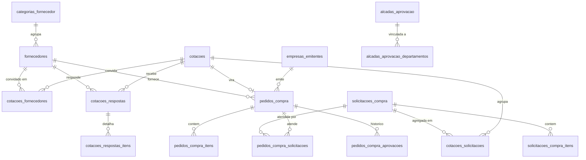

---

## 19. Domínio: Compras — Parte 2 (Notas Fiscais, Contratos, Recebimentos)

### 19.1 `notas_fiscais` (DT6 — `tipo` discrimina entrada/devolução/serviço)

Reunião: 1 pedido pode ter N notas; 1 nota pode estar em 1 pedido. **NÃO detalhamos quais itens estão em cada nota** — só vinculamos NF↔Pedido.

```sql
CREATE TABLE notas_fiscais (
  id                          uuid PRIMARY KEY DEFAULT gen_random_uuid(),
  numero                      text NOT NULL,                     -- número da NF
  serie                       text,                              -- série da NF
  chave_acesso                text UNIQUE,                       -- chave de 44 dígitos (consulta SEFAZ)
  tipo                        text NOT NULL DEFAULT 'entrada',   -- 'entrada' | 'devolucao' | 'servico' (DT6)

  -- Emissor (fornecedor)
  fornecedor_id               uuid NOT NULL REFERENCES fornecedores(id),
  cnpj_emissor                text NOT NULL,                     -- denormalizado p/ histórico

  -- Destinatário (qual CNPJ Gowork)
  empresa_emitente_id         uuid NOT NULL REFERENCES empresas_emitentes(id),

  -- Valores
  moeda_id                    uuid REFERENCES moedas(id),
  valor_produtos              numeric(15,2),
  valor_frete                 numeric(15,2) DEFAULT 0,
  valor_desconto              numeric(15,2) DEFAULT 0,
  valor_impostos              numeric(15,2) DEFAULT 0,
  valor_total                 numeric(15,2) NOT NULL,

  -- Datas
  data_emissao                timestamptz NOT NULL,
  data_entrada                timestamptz,                       -- quando lançada no sistema
  data_vencimento             date,                              -- vencimento (para contas a pagar)

  -- Status
  status                      text NOT NULL DEFAULT 'received',  -- 'received' | 'paid' | 'cancelled' | 'returned'

  -- Anexos
  url_xml                     text,                              -- XML da NF-e
  url_pdf                     text,                              -- DANFE PDF
  url_boleto                  text,

  -- Sincronização Omie
  omie_id                     text UNIQUE,                       -- ID da NF no Omie
  sincronizado_omie_em        timestamptz,

  -- Auditoria
  lancada_por_usuario_id      uuid REFERENCES usuarios(id),
  observacoes                 text,
  criado_em                   timestamptz NOT NULL DEFAULT now(),
  atualizado_em               timestamptz NOT NULL DEFAULT now(),

  CONSTRAINT chk_nf_tipo CHECK (tipo IN ('entrada', 'devolucao', 'servico')),
  CONSTRAINT chk_nf_status CHECK (status IN ('received', 'paid', 'cancelled', 'returned')),
  CONSTRAINT uq_nf_numero_emissor UNIQUE (numero, cnpj_emissor)  -- evita duplicar lançamento
);

-- Vínculo N:N entre NF e Pedidos (1 NF pode atender vários pedidos? Reunião disse não, mas modelagem suporta)
-- Reunião: 1 pedido tem N notas; 1 NF tem 1 pedido. Se mudar, tabela já está pronta.
CREATE TABLE notas_fiscais_pedidos (
  nota_fiscal_id      uuid NOT NULL REFERENCES notas_fiscais(id) ON DELETE CASCADE,
  pedido_compra_id    uuid NOT NULL REFERENCES pedidos_compra(id),
  valor_alocado       numeric(15,2),                             -- caso a NF cubra parcialmente o pedido
  PRIMARY KEY (nota_fiscal_id, pedido_compra_id)
);

CREATE INDEX idx_nf_fornecedor ON notas_fiscais(fornecedor_id, data_emissao DESC);
CREATE INDEX idx_nf_empresa ON notas_fiscais(empresa_emitente_id, data_emissao DESC);
CREATE INDEX idx_nf_status ON notas_fiscais(status);
CREATE INDEX idx_nf_data_emissao ON notas_fiscais(data_emissao DESC);
CREATE INDEX idx_nf_omie ON notas_fiscais(omie_id) WHERE omie_id IS NOT NULL;
CREATE INDEX idx_nf_chave ON notas_fiscais(chave_acesso) WHERE chave_acesso IS NOT NULL;
CREATE INDEX idx_nf_pedidos_nf ON notas_fiscais_pedidos(nota_fiscal_id);
CREATE INDEX idx_nf_pedidos_pedido ON notas_fiscais_pedidos(pedido_compra_id);
```

**Decisões importantes:**
- `chave_acesso` UNIQUE para consultar SEFAZ direto pela NF-e
- `omie_id` permite reconciliar com Omie sem reenviar a mesma NF
- `tipo='servico'` para serviços (sem rastreio de entrega física)
- `tipo='devolucao'` para NFs de devolução ao fornecedor (gera `disposal` ou `exit` em movimentações)
- `notas_fiscais_pedidos` é tabela separada porque 1 NF **pode** virar a cobrir parte de mais de um pedido em casos especiais (futuro)

---

### 19.2 `contratos`

Mãe hierárquica: **Contrato → Pedidos → Notas Fiscais**. Trigger debita saldo automaticamente.

```sql
CREATE TABLE contratos (
  id                          uuid PRIMARY KEY DEFAULT gen_random_uuid(),
  numero                      text NOT NULL UNIQUE,              -- CTR-2026-001
  nome                        text NOT NULL,                     -- 'Manutenção AR-condicionado 2026'

  fornecedor_id               uuid NOT NULL REFERENCES fornecedores(id),
  empresa_emitente_id         uuid NOT NULL REFERENCES empresas_emitentes(id),
  centro_custo_id             uuid REFERENCES centros_custo(id),
  departamento_id             uuid REFERENCES departamentos(id),

  -- Valores
  valor_total                 numeric(15,2) NOT NULL,
  valor_consumido             numeric(15,2) NOT NULL DEFAULT 0,  -- atualizado por trigger
  saldo                       numeric(15,2) GENERATED ALWAYS AS (valor_total - valor_consumido) STORED,

  -- Datas
  data_inicio                 date NOT NULL,
  data_fim                    date NOT NULL,

  -- Status
  status                      text NOT NULL DEFAULT 'active',    -- 'active' | 'concluded' | 'suspended' | 'cancelled'

  -- Anexos
  url_contrato_pdf            text,
  observacoes                 text,
  criado_em                   timestamptz NOT NULL DEFAULT now(),
  atualizado_em               timestamptz NOT NULL DEFAULT now(),

  CONSTRAINT chk_contratos_status CHECK (status IN ('active', 'concluded', 'suspended', 'cancelled')),
  CONSTRAINT chk_contratos_datas CHECK (data_fim >= data_inicio),
  CONSTRAINT chk_contratos_consumido CHECK (valor_consumido >= 0 AND valor_consumido <= valor_total)
);

CREATE INDEX idx_contratos_status ON contratos(status);
CREATE INDEX idx_contratos_fornecedor ON contratos(fornecedor_id);
CREATE INDEX idx_contratos_empresa ON contratos(empresa_emitente_id);
CREATE INDEX idx_contratos_periodo ON contratos(data_inicio, data_fim);
CREATE INDEX idx_contratos_saldo_baixo ON contratos(saldo) WHERE status = 'active' AND saldo < 1000;
```

**Como funciona o débito automático:**
1. Pedido vinculado a contrato (`pedidos_compra.contrato_id`)
2. NF lançada e vinculada ao pedido
3. Trigger `fn_recalcular_contrato_consumido` (Seção 21) soma todas as NFs de pedidos vinculados ao contrato e atualiza `valor_consumido`
4. `saldo` é coluna gerada automaticamente
5. CHECK constraint impede `valor_consumido > valor_total` — bloqueio garantido no banco

**Validação na criação de pedido:**
```sql
-- Aplicação valida ANTES de inserir:
SELECT saldo FROM contratos WHERE id = $1 AND status = 'active' AND saldo >= $valor_pedido;
```

---

### 19.3 `recebimentos_compra`

Quando o item chega fisicamente — pode ser parcial (5 de 10 cadeiras) ou total. Gera entrada no estoque via trigger.

```sql
CREATE TABLE recebimentos_compra (
  id                          uuid PRIMARY KEY DEFAULT gen_random_uuid(),
  pedido_id                   uuid NOT NULL REFERENCES pedidos_compra(id),
  pedido_item_id              uuid NOT NULL REFERENCES pedidos_compra_itens(id),
  nota_fiscal_id              uuid REFERENCES notas_fiscais(id),
  unidade_recebimento_id      uuid NOT NULL REFERENCES unidades(id),  -- onde foi recebido (almox ou unidade)

  quantidade_esperada         numeric(15,3) NOT NULL,
  quantidade_recebida         numeric(15,3) NOT NULL,
  quantidade_avariada         numeric(15,3) DEFAULT 0,           -- recebido mas com defeito
  quantidade_devolvida        numeric(15,3) DEFAULT 0,           -- devolvido ao fornecedor

  data_recebimento            timestamptz NOT NULL DEFAULT now(),
  recebido_por_usuario_id     uuid NOT NULL REFERENCES usuarios(id),
  conferido_por_usuario_id    uuid REFERENCES usuarios(id),

  url_foto_recebimento        text,
  status                      text NOT NULL DEFAULT 'pending_check',

  observacoes                 text,
  criado_em                   timestamptz NOT NULL DEFAULT now(),
  atualizado_em               timestamptz NOT NULL DEFAULT now(),

  CONSTRAINT chk_recebimentos_status CHECK (status IN (
    'pending_check',           -- recebido pela recepção, aguarda CL conferir
    'partial',                 -- conferido, parcial
    'complete',                -- conferido, total
    'rejected'                 -- rejeitado (devolvido)
  )),
  CONSTRAINT chk_recebimentos_qtd CHECK (
    quantidade_recebida >= 0 AND
    quantidade_avariada <= quantidade_recebida AND
    quantidade_devolvida <= quantidade_recebida
  )
);

CREATE INDEX idx_recebimentos_pedido ON recebimentos_compra(pedido_id);
CREATE INDEX idx_recebimentos_item ON recebimentos_compra(pedido_item_id);
CREATE INDEX idx_recebimentos_nf ON recebimentos_compra(nota_fiscal_id);
CREATE INDEX idx_recebimentos_status ON recebimentos_compra(status);
CREATE INDEX idx_recebimentos_unidade ON recebimentos_compra(unidade_recebimento_id, data_recebimento DESC);
```

**Fluxo de status:**
```
pending_check (recepção marcou como recebido, conteúdo não conferido)
  ├── partial   (CL conferiu: chegou parcial)
  ├── complete  (CL conferiu: total OK) → trigger gera movimentacao tipo='entry'
  └── rejected  (CL rejeitou: devolução; gera NF de devolução)
```

**Quando atualizar o estoque?**
- Status `complete`: trigger cria `movimentacoes` tipo `entry` em `unidade_recebimento_id`
- Se `passa_pelo_estoque = false` no pedido E unidade ≠ almox: trigger cria `entry` direto na unidade do solicitante (sem passar pelo almox)

---

### 19.4 Diagrama Compras parte 2

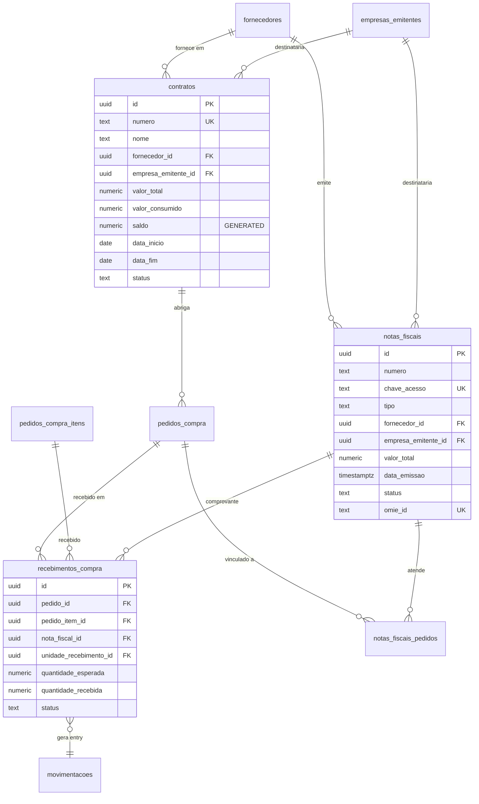

---

## 21. Domínio: Integrações Externas

Cada sistema externo recebe uma tabela própria de configuração + uma tabela genérica `integracoes_jobs` para histórico de syncs e debug.

### 21.1 `integracoes_jobs` (tabela genérica de execuções)

```sql
CREATE TABLE integracoes_jobs (
  id                  uuid PRIMARY KEY DEFAULT gen_random_uuid(),
  sistema             text NOT NULL,                             -- 'omie' | 'mercado_livre' | 'network_go' | 'dexter'
  operacao            text NOT NULL,                             -- 'sync_suppliers' | 'fetch_nf' | 'send_order' | etc.
  direcao             text NOT NULL,                             -- 'inbound' | 'outbound'
  entidade_tipo       text,                                      -- 'fornecedor' | 'pedido' | 'nf' | 'recebimento' | etc.
  entidade_id         uuid,                                      -- ID da entidade afetada
  status              text NOT NULL DEFAULT 'pending',           -- 'pending' | 'running' | 'success' | 'failed' | 'retry'
  request_payload     jsonb,                                     -- payload enviado
  response_payload    jsonb,                                     -- resposta recebida
  erro_mensagem       text,
  erro_stack          text,
  tentativas          int NOT NULL DEFAULT 0,
  proxima_tentativa_em  timestamptz,
  iniciado_em         timestamptz,
  finalizado_em       timestamptz,
  duracao_ms          int,
  triggered_by        text NOT NULL DEFAULT 'system',            -- 'system' | 'manual' | 'webhook' | 'cron'
  triggered_by_user_id  uuid REFERENCES usuarios(id),
  criado_em           timestamptz NOT NULL DEFAULT now(),

  CONSTRAINT chk_jobs_sistema CHECK (sistema IN ('omie', 'mercado_livre', 'network_go', 'dexter')),
  CONSTRAINT chk_jobs_direcao CHECK (direcao IN ('inbound', 'outbound')),
  CONSTRAINT chk_jobs_status CHECK (status IN ('pending', 'running', 'success', 'failed', 'retry'))
);

CREATE INDEX idx_jobs_sistema_status ON integracoes_jobs(sistema, status, criado_em DESC);
CREATE INDEX idx_jobs_entidade ON integracoes_jobs(entidade_tipo, entidade_id);
CREATE INDEX idx_jobs_pendentes ON integracoes_jobs(sistema, proxima_tentativa_em)
  WHERE status IN ('pending', 'retry');
CREATE INDEX idx_jobs_falhas_recentes ON integracoes_jobs(sistema, criado_em DESC)
  WHERE status = 'failed';
```

**Por que existe:** debug, auditoria, retry automático, dashboard de saúde das integrações.

---

### 21.2 `integracoes_omie`

Sync bidirecional: cadastros (fornecedor, produto) saem do SupplyGo → Omie; NFs vêm do Omie → SupplyGo.

```sql
CREATE TABLE integracoes_omie (
  id                          uuid PRIMARY KEY DEFAULT gen_random_uuid(),
  empresa_emitente_id         uuid NOT NULL REFERENCES empresas_emitentes(id),  -- 1 conta Omie por CNPJ

  -- Credenciais (criptografar em produção; aqui só schema)
  app_key                     text NOT NULL,
  app_secret                  text NOT NULL,
  base_url                    text NOT NULL DEFAULT 'https://app.omie.com.br/api/v1',

  -- Configuração de sync
  sync_fornecedores_ativo     boolean DEFAULT true,
  sync_produtos_ativo         boolean DEFAULT true,
  sync_pedidos_ativo          boolean DEFAULT true,
  sync_notas_fiscais_ativo    boolean DEFAULT true,
  sync_contas_pagar_ativo     boolean DEFAULT true,

  intervalo_sync_minutos      int DEFAULT 1440,                  -- 24h por default (reunião)
  ultimo_sync_em              timestamptz,
  ultimo_sync_status          text,                              -- 'success' | 'partial' | 'failed'
  ultimo_sync_erro            text,

  ativo                       boolean DEFAULT true,
  criado_em                   timestamptz NOT NULL DEFAULT now(),
  atualizado_em               timestamptz NOT NULL DEFAULT now(),

  CONSTRAINT uq_integracoes_omie UNIQUE (empresa_emitente_id)
);

-- Mapeamento de IDs entre SupplyGo e Omie (lookup rápido)
CREATE TABLE integracoes_omie_mapeamento (
  id                  uuid PRIMARY KEY DEFAULT gen_random_uuid(),
  empresa_emitente_id uuid NOT NULL REFERENCES empresas_emitentes(id),
  entidade_tipo       text NOT NULL,                             -- 'fornecedor' | 'produto' | 'pedido' | 'nf' | 'centro_custo'
  entidade_local_id   uuid NOT NULL,                             -- ID no SupplyGo
  omie_id             text NOT NULL,                             -- código no Omie
  ultimo_sync_em      timestamptz,
  hash_payload        text,                                      -- detecta mudanças desde último sync

  CONSTRAINT uq_omie_map UNIQUE (empresa_emitente_id, entidade_tipo, entidade_local_id),
  CONSTRAINT uq_omie_map_reverso UNIQUE (empresa_emitente_id, entidade_tipo, omie_id)
);

CREATE INDEX idx_omie_map_local ON integracoes_omie_mapeamento(entidade_tipo, entidade_local_id);
CREATE INDEX idx_omie_map_remoto ON integracoes_omie_mapeamento(entidade_tipo, omie_id);
```

**Operações sincronizadas (reunião):**
- `sync_suppliers_to_omie` — diário ou manual via botão
- `sync_products_to_omie` — diário ou manual
- `send_purchase_order` — quando pedido aprovado
- `fetch_invoices` — diário (busca NFs emitidas para nosso CNPJ via SEFAZ → Omie)
- `send_invoice_to_accounts_payable` — quando NF lançada no SupplyGo

---

### 21.3 `integracoes_ml` (Mercado Livre)

```sql
CREATE TABLE integracoes_ml (
  id                          uuid PRIMARY KEY DEFAULT gen_random_uuid(),
  empresa_emitente_id         uuid NOT NULL REFERENCES empresas_emitentes(id),

  -- OAuth credentials (Mercado Livre usa OAuth 2.0)
  client_id                   text NOT NULL,
  client_secret               text NOT NULL,
  access_token                text,
  refresh_token               text,
  token_expira_em             timestamptz,

  -- Conta vinculada
  ml_user_id                  text,                              -- ID do vendedor no ML
  ml_seller_nickname          text,

  -- Configuração
  sync_pedidos_ativo          boolean DEFAULT true,
  sync_notas_fiscais_ativo    boolean DEFAULT true,
  webhook_url                 text,                              -- URL que ML chama quando há mudança
  webhook_secret              text,                              -- segredo para validar webhooks

  intervalo_sync_minutos      int DEFAULT 60,                    -- mais frequente que Omie (mais dinâmico)
  ultimo_sync_em              timestamptz,

  ativo                       boolean DEFAULT true,
  criado_em                   timestamptz NOT NULL DEFAULT now(),
  atualizado_em               timestamptz NOT NULL DEFAULT now(),

  CONSTRAINT uq_integracoes_ml UNIQUE (empresa_emitente_id)
);

-- Pedidos do ML vinculados aos nossos pedidos_compra
CREATE TABLE integracoes_ml_pedidos (
  id                          uuid PRIMARY KEY DEFAULT gen_random_uuid(),
  pedido_compra_id            uuid REFERENCES pedidos_compra(id),
  ml_order_id                 text NOT NULL UNIQUE,              -- ID do pedido no ML
  ml_status                   text,                              -- 'paid' | 'shipped' | 'delivered' | 'cancelled'
  ml_tracking_code            text,                              -- código de rastreio
  ml_tracking_url             text,
  data_compra_ml              timestamptz,
  data_envio_ml               timestamptz,
  data_entrega_prevista_ml    date,
  data_entrega_realizada_ml   timestamptz,
  ml_payload_completo         jsonb,                             -- snapshot completo da API
  ultimo_sync_em              timestamptz NOT NULL DEFAULT now(),
  criado_em                   timestamptz NOT NULL DEFAULT now()
);

CREATE INDEX idx_ml_pedidos_pedido ON integracoes_ml_pedidos(pedido_compra_id);
CREATE INDEX idx_ml_pedidos_status ON integracoes_ml_pedidos(ml_status);
CREATE INDEX idx_ml_pedidos_tracking ON integracoes_ml_pedidos(ml_tracking_code) WHERE ml_tracking_code IS NOT NULL;
```

**Operações:**
- Webhook do ML chega em endpoint Edge Function → atualiza `ml_status`
- Quando `ml_status = 'shipped'` → cria notificação para destinatário
- Quando ML emite NF-e → puxa via API e cadastra em `notas_fiscais`

---

### 21.4 `integracoes_network_go`

```sql
CREATE TABLE integracoes_network_go (
  id                          uuid PRIMARY KEY DEFAULT gen_random_uuid(),
  unidade_id                  uuid NOT NULL REFERENCES unidades(id),  -- 1 instalação Network Go por prédio
  network_go_endpoint         text NOT NULL,                     -- URL da API do Network Go
  api_key                     text NOT NULL,
  webhook_secret              text,                              -- valida webhooks de "recebido"

  ativo                       boolean DEFAULT true,
  criado_em                   timestamptz NOT NULL DEFAULT now(),
  atualizado_em               timestamptz NOT NULL DEFAULT now(),

  CONSTRAINT uq_network_go UNIQUE (unidade_id)
);
```

**Operações:**
- Quando lote sai com motorista → POST para Network Go criar entrega na aba da recepção
- Quando recepção marca como recebido → webhook chega em Edge Function → cria `confirmacoes_entrega` tipo `reception_receipt` + notificação ao solicitante

---

### 21.5 `integracoes_dexter`

Dexter = LLM/IA usado para WhatsApp e leitura de PDF de orçamento (citado na reunião).

```sql
CREATE TABLE integracoes_dexter (
  id                          uuid PRIMARY KEY DEFAULT gen_random_uuid(),
  api_endpoint                text NOT NULL,
  api_key                     text NOT NULL,
  webhook_secret              text,

  -- Funcionalidades habilitadas
  whatsapp_notif_ativo        boolean DEFAULT true,              -- notificar usuário no WhatsApp
  ocr_orcamento_ativo         boolean DEFAULT true,              -- ler PDF de cotação e preencher resposta
  voz_para_texto_ativo        boolean DEFAULT false,             -- futuro

  ativo                       boolean DEFAULT true,
  criado_em                   timestamptz NOT NULL DEFAULT now(),
  atualizado_em               timestamptz NOT NULL DEFAULT now()
);

-- Histórico de mensagens enviadas (rastreabilidade WhatsApp)
CREATE TABLE integracoes_dexter_mensagens (
  id                  uuid PRIMARY KEY DEFAULT gen_random_uuid(),
  destinatario_user_id  uuid NOT NULL REFERENCES usuarios(id),
  destinatario_telefone text NOT NULL,
  tipo                text NOT NULL,                             -- 'delivery_arrived' | 'order_approved' | 'loan_overdue' | etc.
  mensagem            text NOT NULL,
  entidade_tipo       text,                                      -- 'solicitacao' | 'pedido' | 'lote_entrega'
  entidade_id         uuid,
  status              text NOT NULL DEFAULT 'pending',           -- 'pending' | 'sent' | 'delivered' | 'read' | 'failed'
  mensagem_id_dexter  text,                                      -- ID retornado pelo Dexter
  enviado_em          timestamptz,
  entregue_em         timestamptz,
  lido_em             timestamptz,
  erro_mensagem       text,
  criado_em           timestamptz NOT NULL DEFAULT now(),

  CONSTRAINT chk_dexter_msg_status CHECK (status IN ('pending', 'sent', 'delivered', 'read', 'failed'))
);

-- Histórico de OCR de orçamentos (cotação preenchida via PDF)
CREATE TABLE integracoes_dexter_ocr (
  id                          uuid PRIMARY KEY DEFAULT gen_random_uuid(),
  cotacao_resposta_id         uuid REFERENCES cotacoes_respostas(id),
  arquivo_url                 text NOT NULL,                     -- PDF do orçamento
  payload_extraido            jsonb,                             -- dados estruturados extraídos
  confianca                   numeric(3,2),                      -- 0.00 a 1.00 (confiança do LLM)
  revisado_por_usuario_id     uuid REFERENCES usuarios(id),      -- humano confirmou os dados
  revisado_em                 timestamptz,
  criado_em                   timestamptz NOT NULL DEFAULT now()
);

CREATE INDEX idx_dexter_msg_destinatario ON integracoes_dexter_mensagens(destinatario_user_id, criado_em DESC);
CREATE INDEX idx_dexter_msg_status ON integracoes_dexter_mensagens(status, criado_em DESC);
CREATE INDEX idx_dexter_msg_entidade ON integracoes_dexter_mensagens(entidade_tipo, entidade_id);
CREATE INDEX idx_dexter_ocr_resposta ON integracoes_dexter_ocr(cotacao_resposta_id);
```

---

### 21.6 Diagrama do domínio Integrações

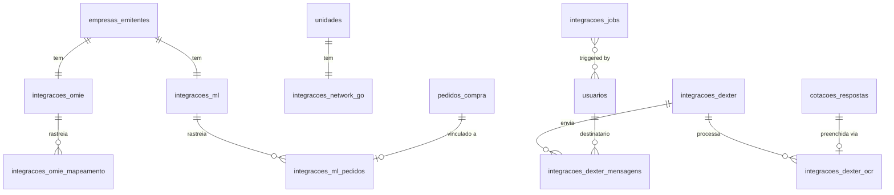

---

## 23. Domínio: Auditoria, Notificações e Permissões

### 23.1 `log_atividades` (timeline genérica)

Substitui as várias tabelas de histórico que existiam antes. **Toda mudança de status relevante** grava aqui.

```sql
CREATE TABLE log_atividades (
  id              uuid PRIMARY KEY DEFAULT gen_random_uuid(),
  tipo_entidade   text NOT NULL,                                 -- 'solicitacao' | 'pedido_compra' | 'lote_entrega' | 'movimentacao' | 'usuario' | 'contrato' | etc.
  entidade_id     uuid NOT NULL,
  acao            text NOT NULL,                                 -- 'created' | 'approved' | 'rejected' | 'status_changed' | 'shipped' | etc.
  usuario_id      uuid REFERENCES usuarios(id),                  -- pode ser NULL (ação automática do sistema)
  status_anterior text,
  status_novo     text,
  dados           jsonb DEFAULT '{}'::jsonb,                     -- snapshot/diff/contexto
  ip_origem       inet,                                          -- IP do request (auditoria)
  user_agent      text,
  criado_em       timestamptz NOT NULL DEFAULT now()
);

CREATE INDEX idx_log_entidade ON log_atividades(tipo_entidade, entidade_id, criado_em DESC);
CREATE INDEX idx_log_usuario ON log_atividades(usuario_id, criado_em DESC);
CREATE INDEX idx_log_acao ON log_atividades(acao, criado_em DESC);
CREATE INDEX idx_log_periodo ON log_atividades(criado_em DESC);
```

**Quem grava aqui:**
- Edge Function ao mudar status de qualquer entidade
- Triggers de banco em mudanças críticas (movimentação, recebimento)
- Ações de admin (login, troca de senha, alteração de permissão)

**Casos de uso:**
- Tela "Detalhes da solicitação" → cabeçalho + timeline
- Dashboard de gargalos: tempo entre `acao='created'` e `acao='approved'`
- Auditoria: quem aprovou/rejeitou e quando
- Notificações em massa: derivar de eventos relevantes

**Decisão DT (era P5):** `log_atividades` **não substitui `notificacoes`**. São coisas diferentes:
- `log_atividades` = histórico imutável, append-only, timeline
- `notificacoes` = caixa de entrada do usuário (com "lido/não lido")

---

### 23.2 `notificacoes`

```sql
CREATE TABLE notificacoes (
  id              uuid PRIMARY KEY DEFAULT gen_random_uuid(),
  usuario_id      uuid NOT NULL REFERENCES usuarios(id),
  tipo            text NOT NULL,                                 -- 'request_approved' | 'delivery_ready' | 'loan_overdue' | etc.
  prioridade      text NOT NULL DEFAULT 'normal',                -- 'low' | 'normal' | 'high' | 'urgent'
  titulo          text NOT NULL,
  mensagem        text,
  link_acao       text,                                          -- URL relativa para abrir no app: '/solicitacoes/{id}'

  -- Vínculo com entidade
  tipo_entidade   text,                                          -- 'solicitacao' | 'pedido_compra' | etc.
  entidade_id     uuid,

  -- Estado
  lido_em         timestamptz,
  arquivado_em    timestamptz,

  -- Canais externos disparados
  enviado_email   boolean DEFAULT false,
  enviado_whatsapp boolean DEFAULT false,                        -- via integracoes_dexter_mensagens
  enviado_push    boolean DEFAULT false,

  criado_em       timestamptz NOT NULL DEFAULT now(),

  CONSTRAINT chk_notificacoes_prioridade CHECK (prioridade IN ('low', 'normal', 'high', 'urgent'))
);

CREATE INDEX idx_notif_usuario_naolidas ON notificacoes(usuario_id, criado_em DESC)
  WHERE lido_em IS NULL AND arquivado_em IS NULL;
CREATE INDEX idx_notif_usuario_todas ON notificacoes(usuario_id, criado_em DESC)
  WHERE arquivado_em IS NULL;
CREATE INDEX idx_notif_entidade ON notificacoes(tipo_entidade, entidade_id);
CREATE INDEX idx_notif_tipo ON notificacoes(tipo, criado_em DESC);
```

**Por que continua tabela própria (decisão sobre P5):**
- Índice parcial `WHERE lido_em IS NULL` é o uso #1 (badge de não-lidas)
- Filtros por usuário muito específicos (sempre `WHERE usuario_id = ?`)
- Estado mutável (`lido_em`, `arquivado_em`) — `log_atividades` é append-only

---

### 23.3 `grupos_acesso`

```sql
CREATE TABLE grupos_acesso (
  id          uuid PRIMARY KEY DEFAULT gen_random_uuid(),
  codigo      text NOT NULL UNIQUE,                              -- 'GRUPO-COMPRAS', 'GRUPO-OBRAS-AVANCADO'
  nome        text NOT NULL,
  descricao   text,
  ativo       boolean DEFAULT true,
  criado_em   timestamptz NOT NULL DEFAULT now(),
  atualizado_em timestamptz NOT NULL DEFAULT now()
);

CREATE INDEX idx_grupos_acesso_ativo ON grupos_acesso(ativo);
```

---

### 23.4 `grupos_acesso_abas`

Quais abas (módulos) cada grupo libera.

```sql
CREATE TABLE grupos_acesso_abas (
  grupo_id    uuid NOT NULL REFERENCES grupos_acesso(id) ON DELETE CASCADE,
  aba_id      text NOT NULL,                                     -- ex: 'almox.estoque', 'compras.fornecedores', 'design.solicitacoes'
  PRIMARY KEY (grupo_id, aba_id)
);

CREATE INDEX idx_grupos_abas_grupo ON grupos_acesso_abas(grupo_id);
CREATE INDEX idx_grupos_abas_aba ON grupos_acesso_abas(aba_id);
```

**Convenção de IDs de aba:** `<dominio>.<recurso>` em snake_case ou kebab-case consistente.

---

### 23.5 `grupos_acesso_membros`

Vínculo N:N entre usuários e grupos.

```sql
CREATE TABLE grupos_acesso_membros (
  grupo_id    uuid NOT NULL REFERENCES grupos_acesso(id) ON DELETE CASCADE,
  usuario_id  uuid NOT NULL REFERENCES usuarios(id) ON DELETE CASCADE,
  criado_em   timestamptz NOT NULL DEFAULT now(),
  criado_por_usuario_id  uuid REFERENCES usuarios(id),
  PRIMARY KEY (grupo_id, usuario_id)
);

CREATE INDEX idx_grupos_membros_grupo ON grupos_acesso_membros(grupo_id);
CREATE INDEX idx_grupos_membros_usuario ON grupos_acesso_membros(usuario_id);
```

---

### 23.6 `usuarios_abas_extras`

Abas concedidas individualmente a um usuário (fora dos grupos).

```sql
CREATE TABLE usuarios_abas_extras (
  usuario_id  uuid NOT NULL REFERENCES usuarios(id) ON DELETE CASCADE,
  aba_id      text NOT NULL,
  motivo      text,                                              -- justificativa textual
  criado_em   timestamptz NOT NULL DEFAULT now(),
  criado_por_usuario_id  uuid REFERENCES usuarios(id),
  PRIMARY KEY (usuario_id, aba_id)
);

CREATE INDEX idx_usuarios_abas_extras_usuario ON usuarios_abas_extras(usuario_id);
```

---

### 23.7 Cálculo final de acesso

**Regra:** abas permitidas para um usuário = união de:
1. Abas dos grupos onde ele é membro (`grupos_acesso_abas` JOIN `grupos_acesso_membros`)
2. Abas extras concedidas direto a ele (`usuarios_abas_extras`)
3. Bypass para perfis privilegiados: `developer | admin | controller` veem tudo
4. Bypass parcial: `purchases_admin` vê apenas abas com prefixo `compras_admin.`

**Query:**
```sql
-- Abas liberadas para um usuário (lógica usada na Edge Function)
WITH grupo_abas AS (
  SELECT DISTINCT gaa.aba_id
    FROM grupos_acesso_membros gam
    JOIN grupos_acesso_abas gaa ON gaa.grupo_id = gam.grupo_id
   WHERE gam.usuario_id = $1
), extra_abas AS (
  SELECT aba_id FROM usuarios_abas_extras WHERE usuario_id = $1
)
SELECT aba_id FROM grupo_abas
UNION
SELECT aba_id FROM extra_abas;
```

---

### 23.8 Diagrama do domínio Permissões e Auditoria

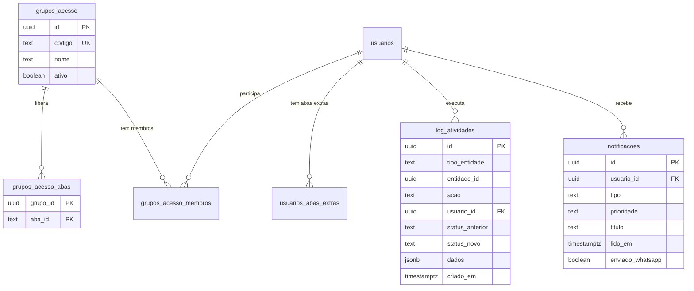

---

## 25. Triggers, Funções e Views

### 25.1 Trigger genérico `set_updated_at`

```sql
CREATE OR REPLACE FUNCTION fn_set_updated_at() RETURNS trigger AS $$
BEGIN
  NEW.atualizado_em := now();
  RETURN NEW;
END $$ LANGUAGE plpgsql;
```

**Aplicar em todas as tabelas que têm `atualizado_em`:**

```sql
DO $$
DECLARE
  t text;
BEGIN
  FOR t IN
    SELECT table_name FROM information_schema.columns
     WHERE column_name = 'atualizado_em' AND table_schema = 'public'
  LOOP
    EXECUTE format(
      'CREATE TRIGGER trg_set_updated_at_%I BEFORE UPDATE ON %I
       FOR EACH ROW EXECUTE FUNCTION fn_set_updated_at()',
       t, t
    );
  END LOOP;
END $$;
```

---

### 25.2 Trigger núcleo `fn_aplicar_movimentacao`

Mantém `estoques_unidade.quantidade` consistente automaticamente.

```sql
CREATE OR REPLACE FUNCTION fn_aplicar_movimentacao() RETURNS trigger AS $$
BEGIN
  CASE NEW.tipo
    WHEN 'entry', 'loan_return' THEN
      INSERT INTO estoques_unidade (item_id, unidade_id, quantidade)
        VALUES (NEW.item_id, NEW.unidade_id, NEW.quantidade)
        ON CONFLICT (item_id, unidade_id)
        DO UPDATE SET quantidade = estoques_unidade.quantidade + NEW.quantidade,
                      atualizado_em = now();

    WHEN 'exit', 'loan_out', 'disposal' THEN
      UPDATE estoques_unidade
         SET quantidade = quantidade - NEW.quantidade,
             atualizado_em = now()
       WHERE item_id = NEW.item_id AND unidade_id = NEW.unidade_id;

      IF NOT FOUND THEN
        RAISE EXCEPTION 'Estoque inexistente para item % na unidade %', NEW.item_id, NEW.unidade_id;
      END IF;

    WHEN 'transfer' THEN
      -- Debita origem
      UPDATE estoques_unidade
         SET quantidade = quantidade - NEW.quantidade, atualizado_em = now()
       WHERE item_id = NEW.item_id AND unidade_id = NEW.unidade_origem_id;

      IF NOT FOUND THEN
        RAISE EXCEPTION 'Estoque inexistente na unidade origem % para item %', NEW.unidade_origem_id, NEW.item_id;
      END IF;

      -- Credita destino (cria linha se não existe)
      INSERT INTO estoques_unidade (item_id, unidade_id, quantidade)
        VALUES (NEW.item_id, NEW.unidade_destino_id, NEW.quantidade)
        ON CONFLICT (item_id, unidade_id)
        DO UPDATE SET quantidade = estoques_unidade.quantidade + NEW.quantidade,
                      atualizado_em = now();

    WHEN 'adjustment' THEN
      -- adjustment.quantidade pode ser negativa
      INSERT INTO estoques_unidade (item_id, unidade_id, quantidade)
        VALUES (NEW.item_id, NEW.unidade_id, GREATEST(NEW.quantidade, 0))
        ON CONFLICT (item_id, unidade_id)
        DO UPDATE SET quantidade = estoques_unidade.quantidade + NEW.quantidade,
                      atualizado_em = now();
  END CASE;

  RETURN NEW;
END $$ LANGUAGE plpgsql SECURITY DEFINER;

CREATE TRIGGER trg_aplicar_movimentacao
  AFTER INSERT ON movimentacoes
  FOR EACH ROW EXECUTE FUNCTION fn_aplicar_movimentacao();
```

**Garantias:**
- `CHECK (quantidade >= 0)` em `estoques_unidade` impede saldo negativo (transação aborta se for o caso)
- `ON CONFLICT` cria a linha automaticamente quando a unidade não tinha o item
- `RAISE EXCEPTION` em casos onde a operação não faz sentido (ex: tentar dar `exit` de algo que não existe)

---

### 25.3 Trigger `fn_recalcular_contrato_consumido`

Recalcula `valor_consumido` do contrato sempre que uma NF é vinculada/desvinculada.

```sql
CREATE OR REPLACE FUNCTION fn_recalcular_contrato_consumido() RETURNS trigger AS $$
DECLARE
  v_contrato_id uuid;
  v_total numeric(15,2);
BEGIN
  -- Descobre o contrato afetado (via pedido vinculado a NF)
  SELECT pc.contrato_id INTO v_contrato_id
    FROM pedidos_compra pc
   WHERE pc.id = COALESCE(NEW.pedido_compra_id, OLD.pedido_compra_id)
     AND pc.contrato_id IS NOT NULL;

  IF v_contrato_id IS NULL THEN
    RETURN COALESCE(NEW, OLD);
  END IF;

  -- Soma todas as NFs ligadas a pedidos deste contrato
  SELECT COALESCE(SUM(nf.valor_total), 0) INTO v_total
    FROM notas_fiscais nf
    JOIN notas_fiscais_pedidos nfp ON nfp.nota_fiscal_id = nf.id
    JOIN pedidos_compra pc ON pc.id = nfp.pedido_compra_id
   WHERE pc.contrato_id = v_contrato_id
     AND nf.status NOT IN ('cancelled', 'returned');

  UPDATE contratos
     SET valor_consumido = v_total,
         atualizado_em = now()
   WHERE id = v_contrato_id;

  RETURN COALESCE(NEW, OLD);
END $$ LANGUAGE plpgsql SECURITY DEFINER;

CREATE TRIGGER trg_recalc_contrato_insert
  AFTER INSERT ON notas_fiscais_pedidos
  FOR EACH ROW EXECUTE FUNCTION fn_recalcular_contrato_consumido();

CREATE TRIGGER trg_recalc_contrato_update
  AFTER UPDATE OF status ON notas_fiscais
  FOR EACH ROW EXECUTE FUNCTION fn_recalcular_contrato_consumido();

CREATE TRIGGER trg_recalc_contrato_delete
  AFTER DELETE ON notas_fiscais_pedidos
  FOR EACH ROW EXECUTE FUNCTION fn_recalcular_contrato_consumido();
```

---

### 25.4 Trigger `fn_recebimento_complete_gera_movimentacao`

Quando recebimento marca como `complete`, gera entrada automática no estoque.

```sql
CREATE OR REPLACE FUNCTION fn_recebimento_gera_movimentacao() RETURNS trigger AS $$
DECLARE
  v_pedido_item RECORD;
  v_passa_pelo_estoque boolean;
BEGIN
  IF NEW.status = 'complete' AND (OLD.status IS NULL OR OLD.status <> 'complete') THEN
    SELECT pci.item_id, pci.unidade_medida, pc.passa_pelo_estoque
      INTO v_pedido_item
      FROM pedidos_compra_itens pci
      JOIN pedidos_compra pc ON pc.id = pci.pedido_id
     WHERE pci.id = NEW.pedido_item_id;

    IF v_pedido_item.item_id IS NOT NULL THEN
      INSERT INTO movimentacoes (
        tipo, item_id, quantidade, usuario_id,
        unidade_id, pedido_compra_id, nota_fiscal_id, observacoes
      ) VALUES (
        'entry',
        v_pedido_item.item_id,
        NEW.quantidade_recebida - NEW.quantidade_avariada - NEW.quantidade_devolvida,
        NEW.recebido_por_usuario_id,
        NEW.unidade_recebimento_id,
        NEW.pedido_id,
        NEW.nota_fiscal_id,
        'Entrada automática via recebimento de compra'
      );
    END IF;
  END IF;

  RETURN NEW;
END $$ LANGUAGE plpgsql SECURITY DEFINER;

CREATE TRIGGER trg_recebimento_gera_movimentacao
  AFTER INSERT OR UPDATE OF status ON recebimentos_compra
  FOR EACH ROW EXECUTE FUNCTION fn_recebimento_gera_movimentacao();
```

---

### 25.5 Triggers de numeração legível

Geram `SOL-2026-00001`, `PED-2026-00001`, etc.

```sql
CREATE SEQUENCE IF NOT EXISTS seq_solicitacoes;
CREATE SEQUENCE IF NOT EXISTS seq_solicitacoes_compra;
CREATE SEQUENCE IF NOT EXISTS seq_cotacoes;
CREATE SEQUENCE IF NOT EXISTS seq_pedidos_compra;
CREATE SEQUENCE IF NOT EXISTS seq_lotes_entrega;

CREATE OR REPLACE FUNCTION fn_gerar_numero_legivel(prefixo text, sequencia text)
  RETURNS text AS $$
BEGIN
  RETURN prefixo || '-' || EXTRACT(YEAR FROM now()) || '-' ||
         LPAD(NEXTVAL(sequencia)::text, 5, '0');
END $$ LANGUAGE plpgsql;

-- Trigger para solicitacoes
CREATE OR REPLACE FUNCTION fn_numero_solicitacao() RETURNS trigger AS $$
BEGIN
  IF NEW.numero IS NULL THEN
    NEW.numero := fn_gerar_numero_legivel('SOL', 'seq_solicitacoes');
  END IF;
  RETURN NEW;
END $$ LANGUAGE plpgsql;

CREATE TRIGGER trg_numero_solicitacao BEFORE INSERT ON solicitacoes
  FOR EACH ROW EXECUTE FUNCTION fn_numero_solicitacao();

-- Análogos para cada tabela com numero:
-- solicitacoes_compra → SC, cotacoes → COT, pedidos_compra → PED, lotes_entrega → LOTE
```

---

### 25.6 Triggers de log automático em mudança de status

Para entidades-chave: solicitação, pedido_compra, lote_entrega, contrato, recebimento_compra.

```sql
CREATE OR REPLACE FUNCTION fn_log_status_change() RETURNS trigger AS $$
DECLARE
  v_tipo_entidade text := TG_ARGV[0];
BEGIN
  IF NEW.status IS DISTINCT FROM OLD.status THEN
    INSERT INTO log_atividades (
      tipo_entidade, entidade_id, acao, usuario_id,
      status_anterior, status_novo, dados
    ) VALUES (
      v_tipo_entidade,
      NEW.id,
      'status_changed',
      current_setting('app.usuario_id', true)::uuid,  -- setado pela Edge Function
      OLD.status,
      NEW.status,
      jsonb_build_object('numero', NEW.numero)
    );
  END IF;
  RETURN NEW;
END $$ LANGUAGE plpgsql;

CREATE TRIGGER trg_log_status_solicitacoes
  AFTER UPDATE OF status ON solicitacoes
  FOR EACH ROW EXECUTE FUNCTION fn_log_status_change('solicitacao');

CREATE TRIGGER trg_log_status_pedidos
  AFTER UPDATE OF status ON pedidos_compra
  FOR EACH ROW EXECUTE FUNCTION fn_log_status_change('pedido_compra');

CREATE TRIGGER trg_log_status_lotes
  AFTER UPDATE OF status ON lotes_entrega
  FOR EACH ROW EXECUTE FUNCTION fn_log_status_change('lote_entrega');

CREATE TRIGGER trg_log_status_recebimentos
  AFTER UPDATE OF status ON recebimentos_compra
  FOR EACH ROW EXECUTE FUNCTION fn_log_status_change('recebimento_compra');

-- Edge Function deve setar 'app.usuario_id' por request:
-- SELECT set_config('app.usuario_id', '<uuid>', true);
```

---

### 25.7 Views úteis

```sql
-- Empréstimos ativos (loan_out sem loan_return correspondente)
CREATE OR REPLACE VIEW emprestimos_ativos AS
SELECT m.*
  FROM movimentacoes m
 WHERE m.tipo = 'loan_out'
   AND NOT EXISTS (
     SELECT 1 FROM movimentacoes r
      WHERE r.tipo = 'loan_return' AND r.movimentacao_origem_id = m.id
   );

-- Empréstimos atrasados (devolução prevista < hoje)
CREATE OR REPLACE VIEW emprestimos_atrasados AS
SELECT * FROM emprestimos_ativos
 WHERE emprestimo_devolucao_prevista < now();

-- Solicitações pendentes (para badge no menu)
CREATE OR REPLACE VIEW solicitacoes_pendentes AS
SELECT s.*,
       i.nome AS item_nome,
       u.nome AS solicitante_nome,
       un.nome AS unidade_nome
  FROM solicitacoes s
  JOIN itens i ON i.id = s.item_id
  JOIN usuarios u ON u.id = s.solicitado_por_usuario_id
  JOIN unidades un ON un.id = s.unidade_solicitante_id
 WHERE s.status IN (
   'pending', 'pending_designer', 'pending_approval',
   'approved', 'awaiting_pickup', 'awaiting_delivery'
 );

-- Pedidos aguardando aprovação por alçada
CREATE OR REPLACE VIEW pedidos_aguardando_aprovacao AS
SELECT pc.*,
       f.razao_social AS fornecedor_razao_social,
       u.nome AS comprador_nome,
       a.nome AS aprovador_nome
  FROM pedidos_compra pc
  JOIN fornecedores f ON f.id = pc.fornecedor_id
  JOIN usuarios u ON u.id = pc.comprador_id
  LEFT JOIN usuarios a ON a.id = pc.aprovador_alcada_id
 WHERE pc.status_aprovacao = 'pendente';

-- Contratos com saldo baixo (atenção)
CREATE OR REPLACE VIEW contratos_proximos_vencimento AS
SELECT c.*,
       f.razao_social AS fornecedor_razao_social,
       (c.data_fim - CURRENT_DATE) AS dias_para_vencer,
       (c.saldo / NULLIF(c.valor_total, 0) * 100) AS percentual_saldo
  FROM contratos c
  JOIN fornecedores f ON f.id = c.fornecedor_id
 WHERE c.status = 'active'
   AND (c.data_fim - CURRENT_DATE <= 30 OR c.saldo / NULLIF(c.valor_total, 0) < 0.10);

-- Itens em estoque abaixo do mínimo (alerta de ressuprimento)
CREATE OR REPLACE VIEW estoques_abaixo_minimo AS
SELECT eu.*,
       i.nome AS item_nome,
       i.produto_codigo,
       un.nome AS unidade_nome,
       (eu.quantidade_minima - eu.quantidade) AS deficit
  FROM estoques_unidade eu
  JOIN itens i ON i.id = eu.item_id
  JOIN unidades un ON un.id = eu.unidade_id
 WHERE eu.quantidade < eu.quantidade_minima
   AND i.ativo = true;

-- Tempo médio em cada etapa (dashboard de gargalos)
CREATE OR REPLACE VIEW solicitacoes_tempo_etapas AS
SELECT s.id,
       s.numero,
       s.tipo,
       s.status,
       s.criado_em,
       s.aprovado_em,
       s.concluido_em,
       EXTRACT(EPOCH FROM (s.aprovado_em - s.criado_em))/3600 AS horas_ate_aprovacao,
       EXTRACT(EPOCH FROM (s.concluido_em - s.aprovado_em))/3600 AS horas_aprovacao_a_conclusao,
       EXTRACT(EPOCH FROM (s.concluido_em - s.criado_em))/3600 AS horas_total
  FROM solicitacoes s
 WHERE s.concluido_em IS NOT NULL;
```

---

### 25.8 Resumo dos índices criados (por domínio)

| Domínio | Índices | Tipo |
|---|---|---|
| Identidade | `idx_usuarios_perfil` (parcial), `idx_usuarios_*_id`, `idx_empresas_emitentes_cnpj` | btree |
| Catálogo | `idx_itens_categoria`, `idx_itens_eh_movel` (parcial), `idx_itens_nome_search` | btree + GIN |
| Estoque | `idx_estoques_*`, `idx_estoques_abaixo_minimo` (parcial), `idx_mov_*` | btree |
| Solicitações | `idx_solicitacoes_tipo_status`, `idx_solicitacoes_pendentes` (parcial) | btree |
| Entregas | `idx_lotes_*`, `idx_confirm_*` | btree |
| Compras | `idx_pedidos_*`, `idx_pedidos_aprovador` (parcial), `idx_fornecedores_busca` (GIN) | btree + GIN |
| Integrações | `idx_jobs_pendentes` (parcial), `idx_omie_map_*` | btree |
| Auditoria | `idx_log_entidade`, `idx_notif_usuario_naolidas` (parcial) | btree |
| Permissões | `idx_grupos_*`, `idx_usuarios_abas_extras_usuario` | btree |

**Total estimado:** ~70 índices (sendo ~15 parciais para queries muito específicas).

---

## 27. Consolidação Final

### 27.1 Lista completa de tabelas em ordem de criação (resolve dependências FK)

```
ORDEM DE CRIACAO (CREATE TABLE deve seguir esta sequência):

NIVEL 0 — sem dependências
  01. moedas
  02. categorias
  03. categorias_fornecedor
  04. departamentos
  05. empresas_emitentes
  06. grupos_acesso
  07. grupos_acesso_abas

NIVEL 1 — dependem de nível 0
  08. centros_custo               (FK → empresas_emitentes)
  09. fornecedores                (FK → categorias_fornecedor)
  10. unidades                    (FK → empresas_emitentes)

NIVEL 2 — dependem de nível 0/1
  11. usuarios                    (FK → unidades, departamentos)
  12. itens                       (FK → categorias, empresas_emitentes, fornecedores)

NIVEL 3 — dependem de nível 2
  13. itens_seriais               (FK → itens, unidades, usuarios)
  14. estoques_unidade            (FK → itens, unidades)

NIVEL 4 — núcleo operacional (dependem de nível 3)
  15. solicitacoes                (FK → itens, unidades, usuarios)
  16. solicitacoes_compra         (FK → usuarios, unidades, departamentos, centros_custo, empresas_emitentes, fornecedores)
  17. solicitacoes_compra_itens   (FK → solicitacoes_compra, itens)
  18. contratos                   (FK → fornecedores, empresas_emitentes, centros_custo, departamentos)

NIVEL 5 — compras
  19. cotacoes                    (FK → usuarios, unidades, fornecedores)
  20. cotacoes_solicitacoes       (FK → cotacoes, solicitacoes_compra)
  21. cotacoes_fornecedores       (FK → cotacoes, fornecedores)
  22. cotacoes_respostas          (FK → cotacoes, cotacoes_fornecedores, fornecedores, moedas)
  23. cotacoes_respostas_itens    (FK → cotacoes_respostas, solicitacoes_compra_itens)
  24. pedidos_compra              (FK → cotacoes, fornecedores, empresas_emitentes, usuarios, contratos, unidades, moedas)
  25. pedidos_compra_itens        (FK → pedidos_compra, solicitacoes_compra_itens, itens, centros_custo)
  26. pedidos_compra_solicitacoes (FK → pedidos_compra, solicitacoes_compra)
  27. pedidos_compra_aprovacoes   (FK → pedidos_compra, usuarios)
  28. alcadas_aprovacao           (FK → usuarios)
  29. alcadas_aprovacao_departamentos (FK → alcadas_aprovacao, departamentos)
  30. notas_fiscais               (FK → fornecedores, empresas_emitentes, moedas, usuarios)
  31. notas_fiscais_pedidos       (FK → notas_fiscais, pedidos_compra)
  32. recebimentos_compra         (FK → pedidos_compra, pedidos_compra_itens, notas_fiscais, unidades, usuarios)

NIVEL 6 — entregas (dependem de solicitacoes)
  33. lotes_entrega               (FK → unidades, usuarios)
  34. lotes_entrega_itens         (FK → lotes_entrega, solicitacoes)
  35. confirmacoes_entrega        (FK → lotes_entrega, solicitacoes, usuarios)

NIVEL 7 — movimentações (depende de TUDO; pode referenciar todos os fluxos)
  36. movimentacoes               (FK → itens, usuarios, unidades, solicitacoes, lotes_entrega,
                                       itens_seriais, pedidos_compra, notas_fiscais, movimentacoes [self])

NIVEL 8 — auditoria, permissões, integrações (independentes)
  37. log_atividades              (FK → usuarios)
  38. notificacoes                (FK → usuarios)
  39. grupos_acesso_membros       (FK → grupos_acesso, usuarios)
  40. usuarios_abas_extras        (FK → usuarios)
  41. integracoes_jobs            (FK → usuarios)
  42. integracoes_omie            (FK → empresas_emitentes)
  43. integracoes_omie_mapeamento (FK → empresas_emitentes)
  44. integracoes_ml              (FK → empresas_emitentes)
  45. integracoes_ml_pedidos      (FK → pedidos_compra)
  46. integracoes_network_go      (FK → unidades)
  47. integracoes_dexter
  48. integracoes_dexter_mensagens (FK → usuarios)
  49. integracoes_dexter_ocr      (FK → cotacoes_respostas, usuarios)
```

**Total: 49 tabelas** (ligeiramente acima da estimativa inicial de 37 — o crescimento veio de tabelas N:N e tabelas auxiliares de integrações que apareceram nas Seções 17, 19 e 21).

---

### 27.2 Ordem de DROP (caso queira recriar do zero)

DROP em ordem **inversa** ao CREATE. Mas o SQL pode usar `DROP TABLE ... CASCADE` para simplificar:

```sql
-- Forma rápida (NÃO usar em produção; serve para dev/staging)
DROP SCHEMA public CASCADE;
CREATE SCHEMA public;
GRANT USAGE ON SCHEMA public TO postgres;
GRANT ALL ON SCHEMA public TO postgres;

-- Depois, recriar tabelas na ordem da Seção 27.1
```

**Atenção:** isso apaga **TUDO**, inclusive extensões e funções. Se houver extensões (uuid-ossp, etc), recriar:

```sql
CREATE EXTENSION IF NOT EXISTS "uuid-ossp";
CREATE EXTENSION IF NOT EXISTS "pgcrypto";  -- gen_random_uuid()
```

---

### 27.3 Seed inicial mínimo (sugerido)

```sql
-- Empresas emitentes (4 CNPJs Gowork - VALORES A CONFIRMAR)
INSERT INTO empresas_emitentes (razao_social, nome_fantasia, cnpj, regime_tributario) VALUES
  ('GO WORK NEGOCIOS LTDA',   'Goevo Offices', '00000000000001', 'lucro_presumido'),
  ('GO WORK SERVICOS LTDA',   'Co-Services',   '00000000000002', 'lucro_presumido'),
  ('___ a definir ___',       '___ CNPJ 3 ___', '00000000000003', null),
  ('___ a definir ___',       '___ CNPJ 4 ___', '00000000000004', null);

-- Moedas
INSERT INTO moedas (codigo, simbolo, nome) VALUES
  ('BRL', 'R$', 'Real Brasileiro'),
  ('USD', '$',  'Dólar Americano'),
  ('EUR', '€',  'Euro');

-- Categorias básicas
INSERT INTO categorias (nome) VALUES
  ('Material de Escritório'),
  ('Mobiliário'),
  ('Eletrônicos'),
  ('Limpeza e Higiene'),
  ('Café e Copa'),
  ('Material de Construção'),
  ('Equipamentos Técnicos');

-- Categorias de fornecedor
INSERT INTO categorias_fornecedor (nome) VALUES
  ('E-commerce (Mercado Livre, Shopee)'),
  ('Distribuidor'),
  ('Fabricante'),
  ('Prestador de Serviço'),
  ('Marketplace Direto'),
  ('Importador');

-- Grupos de acesso padrão
INSERT INTO grupos_acesso (codigo, nome, descricao) VALUES
  ('GRUPO-ALMOX',          'Almoxarifado',     'Acesso a estoque e movimentações'),
  ('GRUPO-COMPRAS',        'Compras',          'Acesso ao módulo de compras'),
  ('GRUPO-OBRAS',          'Obras',            'Solicitação e acompanhamento de obras'),
  ('GRUPO-ARQUITETURA',    'Arquitetura',      'Solicitações e aprovação de móveis'),
  ('GRUPO-FACILITIES',     'Facilities',       'Manutenção predial'),
  ('GRUPO-RECEPCAO',       'Recepção',         'Confirmação de recebimento');

-- Alçadas conforme reunião (R$ 4999.99 vira corte; preencher uuid_sanchez/uuid_mike depois)
INSERT INTO alcadas_aprovacao (escopo, perfil_aprovador, valor_limite_min, valor_limite_max) VALUES
  ('pedido', 'admin', 0, 4999.99),
  ('pedido', 'admin', 5000.00, NULL);
-- Substituir 'admin' por usuario_id específico após cadastrar Sanchez e Mike
```

---

### 27.4 Glossário pt ↔ en (consolidado)

#### Tabelas

| Domínio antigo | Tabela definitiva |
|---|---|
| `users` / `org_*` (5) | `usuarios`, `unidades`, `departamentos`, `centros_custo`, `moedas` |
| Novo (4 CNPJs) | `empresas_emitentes` |
| `stock_categories` | `categorias` |
| `stock_items` (com `is_furniture`) | `itens` (com `eh_movel`) |
| `stock_unique_product_instances` | `itens_seriais` |
| `stock_unit_stocks` | `estoques_unidade` |
| `stock_movements` + `stock_simple_movements` + `stock_loans` + `furniture_transfers` | `movimentacoes` (única) |
| `stock_requests` + `furniture_*_requests` | `solicitacoes` (única, com `tipo`) |
| `purchase_delivery_batches` | `lotes_entrega` |
| Novo (normalizado) | `lotes_entrega_itens` |
| `purchase_delivery_confirmations` | `confirmacoes_entrega` |
| `purchase_suppliers` | `fornecedores` |
| `purchase_supplier_categories` | `categorias_fornecedor` |
| `purchase_requests` | `solicitacoes_compra` |
| Novo (normalizado) | `solicitacoes_compra_itens` |
| `purchase_quotations` | `cotacoes` |
| Novo (N:N) | `cotacoes_solicitacoes`, `cotacoes_fornecedores` |
| Novo (DT4) | `cotacoes_respostas`, `cotacoes_respostas_itens` |
| `purchase_orders` | `pedidos_compra` |
| `purchase_order_items` | `pedidos_compra_itens` |
| Novo (N:N) | `pedidos_compra_solicitacoes` |
| `purchase_order_approvals` | `pedidos_compra_aprovacoes` |
| `purchase_approval_config` | `alcadas_aprovacao` |
| `purchase_approval_config_departments` | `alcadas_aprovacao_departamentos` |
| Novo | `notas_fiscais`, `notas_fiscais_pedidos` |
| `purchase_contracts` | `contratos` |
| `purchase_receivings` | `recebimentos_compra` |
| Novo | `log_atividades` |
| `notifications` | `notificacoes` |
| `access_groups` | `grupos_acesso` |
| `access_group_tabs` | `grupos_acesso_abas` |
| `access_group_members` | `grupos_acesso_membros` |
| `user_extra_tabs` | `usuarios_abas_extras` |
| Novo (4 sistemas) | `integracoes_omie`, `integracoes_ml`, `integracoes_network_go`, `integracoes_dexter` |
| Novo (auxiliar) | `integracoes_jobs`, `integracoes_omie_mapeamento`, `integracoes_ml_pedidos`, `integracoes_dexter_mensagens`, `integracoes_dexter_ocr` |

#### Colunas (resumo dos padrões)

| Padrão antigo (en) | Padrão novo (pt) |
|---|---|
| `created_at` / `updated_at` | `criado_em` / `atualizado_em` |
| `name` / `description` / `notes` | `nome` / `descricao` / `observacoes` |
| `quantity` / `minimum_quantity` | `quantidade` / `quantidade_minima` |
| `is_*` | `eh_*` (`eh_movel`, `eh_consumivel`, `eh_serial_unico`) |
| `default_*` | `*_padrao` (`dias_emprestimo_padrao`, `quantidade_minima_padrao`) |
| `*_id` (FK) | `*_id` em pt (`usuario_id`, `unidade_id`, `solicitacao_id`) |
| `from_unit_id` / `to_unit_id` | `unidade_origem_id` / `unidade_destino_id` |
| `borrower_user_id` | `tomador_usuario_id` |
| `loan_due_date` | `emprestimo_devolucao_prevista` |
| `target_floor` / `location_detail` | `andar_destino` / `localizacao_detalhe` |
| `disposal_decision` / `disposal_justification` | `decisao_descarte` / `justificativa_descarte` |
| `qr_code` | `codigo_qr` |
| `picked_up_*` / `delivered_at` / `completed_at` | `retirado_*` / `entregue_em` / `concluido_em` |
| `entity_type` / `entity_id` / `action` / `payload` | `tipo_entidade` / `entidade_id` / `acao` / `dados` |
| `read_at` | `lido_em` |
| `role` / `job_title` | `perfil` / `cargo` |
| `address` / `floors` | `endereco` / `andares` |
| `daily_code` / `daily_code_generated_at` | `codigo_diario` / `codigo_diario_gerado_em` |

#### Termos preservados em inglês/sigla

`id`, `email`, `auth`, `qr`, `url`, `cnpj`, `cpf`, `pix`, `status`, `jsonb`, `uuid`, `inet`, `ts`, valores de enum (`'entry'`, `'approved'`, `'pending'`, etc.)

---

### 27.5 Checklist de execução

**Antes de rodar o SQL em produção:**
- [ ] Confirmar com Sanchez/Mike: razão social e CNPJ das 4 empresas emitentes
- [ ] Confirmar regra de alçada exata (R$ 4.999 ou outro valor, se mudou)
- [ ] Resolver pendências P2, P5, P6, P8, P10, P11 da Seção 5.2
- [ ] Definir lista de IDs de aba (`aba_id` em `grupos_acesso_abas`) — convenção `dominio.recurso`
- [ ] Confirmar credenciais Omie por empresa (4 contas?)
- [ ] Validar com Angela se Network Go terá API e qual a URL
- [ ] Definir lista inicial de departamentos (Obras, Arquitetura, Facilities, TI, Comercial...)
- [ ] Lista de centros de custo iniciais

**Roteiro de execução do SQL:**
1. Backup do banco atual (mesmo não estando em produção, garantia)
2. `DROP SCHEMA public CASCADE; CREATE SCHEMA public;`
3. Recriar extensões: `pgcrypto`
4. Executar CREATE TABLE na ordem da Seção 27.1
5. Executar CREATE INDEX (vão junto com os CREATE TABLE)
6. Executar CREATE FUNCTION e CREATE TRIGGER da Seção 25
7. Executar CREATE VIEW da Seção 25.7
8. Aplicar `fn_set_updated_at` em massa via DO BLOCK da Seção 25.1
9. Inserir seed inicial da Seção 27.3
10. Inserir Sanchez, Mike e demais usuários iniciais
11. Atualizar `alcadas_aprovacao.usuario_id` com os UUIDs reais

**Após execução:**
- [ ] Conferir: `SELECT COUNT(*) FROM information_schema.tables WHERE table_schema = 'public';` → deve retornar 49
- [ ] Conferir: `SELECT COUNT(*) FROM information_schema.triggers WHERE trigger_schema = 'public';` → deve retornar ~30+
- [ ] Conferir: `SELECT COUNT(*) FROM information_schema.views WHERE table_schema = 'public';` → deve retornar 6

---

### 27.6 Pendências finais em aberto

Tudo que ficou para decisão do PO antes de gerar o SQL final executável:

| # | Pendência | Categoria |
|---|---|---|
| P2 | `itens_seriais` agora ou depois | **Recomendado: agora** |
| P5 | `notificacoes` separada de `log_atividades` | **Decidido: separada** (já refletido no schema) |
| P6 | Manter perfil `executor` | **Decidido: removido** (já refletido no CHECK) |
| P8 | Caixinha (cartão Suhaila) entra no sistema? | **Pendente — decisão de gestão** |
| P10 | Cancelamento de pedido pós-envio | **Decidido: status `cancelled`** (já no schema) |
| P11 | Aprovação fora do horário / delegação SLA | **V2 — fora do MVP** |

Decisões já tomadas e refletidas no schema:
- DT1 a DT6 (Seção 5.1) — todas aplicadas
- D1 a D16 (Seção 4) — todas aplicadas

---

### 27.7 Próximos passos após este documento

1. **Você revisa** este documento e contesta o que não fizer sentido
2. Resolver P8 com Sanchez (caixinha)
3. Confirmar dados das 4 empresas emitentes
4. Eu monto o **arquivo SQL único** (`DOCs/migration-001-schema-novo.sql`) executável
5. Você roda em ambiente de dev primeiro, valida estruturalmente
6. Refatoração do frontend (`src/`) para usar nomes em pt-camelCase nos tipos TS
7. Refatoração da Edge Function para os novos endpoints
8. Recriar seed de dados de teste

---

**Documento concluído.** Total: 27 seções, 49 tabelas, 6 views, ~30 triggers, ~70 índices.

